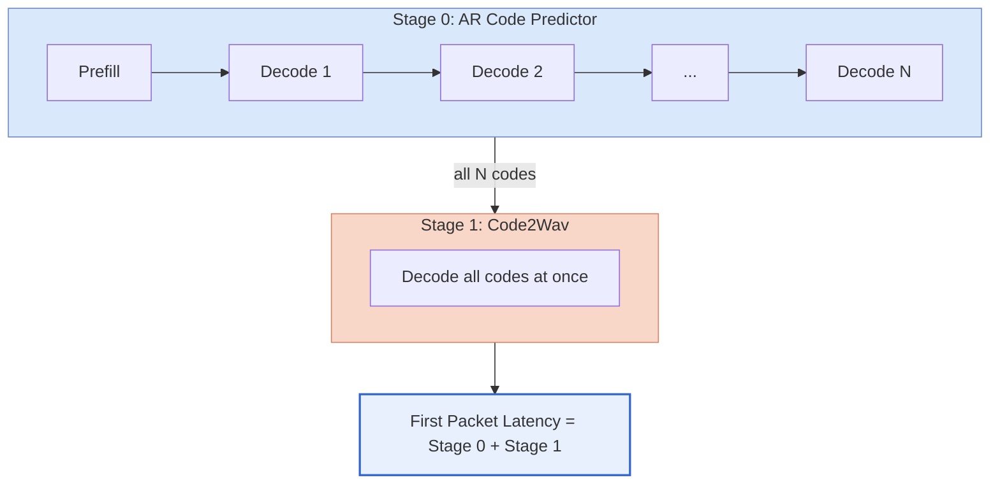
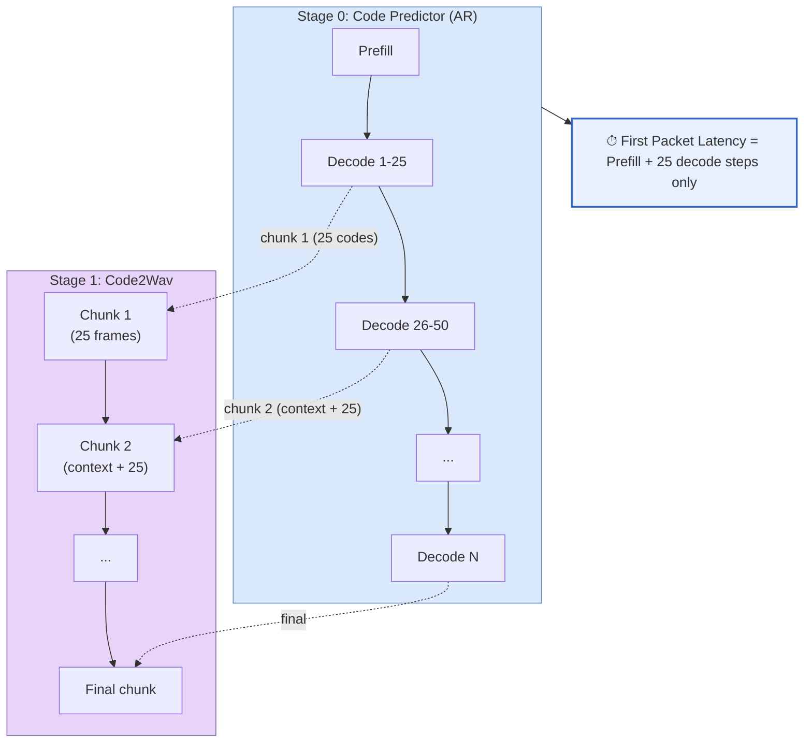

# Adding a TTS Model

This guide walks through adding a new TTS model to vLLM-Omni, using **Qwen3-TTS**
as a reference. Qwen3-TTS demonstrates the standard two-stage TTS pipeline and the
key optimizations all TTS models in this repo should follow.

## Table of Contents

1. [Overview](#overview)
2. [Directory Structure](#directory-structure)
3. [Step-by-Step Implementation](#step-by-step-implementation)
4. [Key Components](#key-components)
5. [Model Registration](#model-registration)
6. [Stage Configuration](#stage-configuration)
7. [Stage Input Processors](#stage-input-processors)
8. [Testing](#testing)
9. [Summary](#summary)

## Overview

vLLM-Omni supports TTS models as multi-stage pipelines where each stage runs independently
and can be placed on different devices. Qwen3-TTS has two stages:

| Stage | Name | Input | Output |
|-------|------|-------|--------|
| 0 | Code Predictor (AR) | Text tokens | Discrete RVQ codec codes |
| 1 | Code2Wav (Decoder) | RVQ codec codes | Audio waveform |

Each stage is a separate model class configured independently via YAML. The two stages
are connected by the `async_chunk` framework, which enables inter-stage streaming for
low first-packet latency (see [Async Chunk Design](../../design/feature/async_chunk_design.md)).

### Without async_chunk (batch mode)

Stage 0 runs to completion before Stage 1 starts, resulting in long first-packet latency:



### With async_chunk (streaming mode)

Stage 0 sends codec codes to Stage 1 every `chunk_size=25` tokens. Stage 1 begins decoding
immediately, reducing first-packet latency from the full AR time to just the first chunk:



Key parameters: `chunk_size=25`, `left_context_size=25` (validated defaults from Qwen3-TTS
and Qwen3-Omni).

## Directory Structure

When adding a new TTS model, create the following structure:

```
vllm_omni/model_executor/models/
  your_model_name/
    __init__.py
    your_model.py                    # Unified class (stage dispatch)
    your_model_ar_stage.py           # Stage 0: AR stage
    your_model_decoder.py            # Stage 1: audio decoder

vllm_omni/model_executor/stage_input_processors/
  your_model_name.py                 # Stage 0 -> Stage 1 transition

vllm_omni/model_executor/stage_configs/
  your_model_name.yaml               # Batch mode config
  your_model_name_async_chunk.yaml   # Streaming mode config
```

**Qwen3-TTS reference files:**

| File | Purpose |
|------|---------|
| `models/qwen3_tts/qwen3_tts.py` | Unified model class |
| `models/qwen3_tts/qwen3_tts_code_predictor_vllm.py` | Stage 0 - optimized AR |
| `models/qwen3_tts/qwen3_tts_code2wav.py` | Stage 1 - decoder |
| `stage_configs/qwen3_tts.yaml` | Stage config (async_chunk enabled) |
| `stage_configs/qwen3_tts_batch.yaml` | Batch mode config |
| `stage_input_processors/qwen3_tts.py` | Stage transition processors |

## Step-by-Step Implementation

### Step 1: Implement Stage 0 - AR Stage

Stage 0 is the autoregressive stage that generates intermediate audio representations.
**It must use vLLM's native decoder layers with fused ops and PagedAttention** for the LLM
backbone - this is the primary source of speedup over HuggingFace inference.

#### 1.1 Use vLLM Decoder Layers Directly

Build your transformer layers from the corresponding vLLM decoder layer class (e.g.
`Qwen3DecoderLayer` for Qwen3-based backbones, or the equivalent for LLaMA, Qwen2, etc.).
Do not wrap the HuggingFace model directly - that bypasses PagedAttention and fused kernels.

```python
# your_model_ar_stage.py

from vllm.model_executor.models.qwen3 import Qwen3DecoderLayer

class YourTTSARStage(nn.Module):

    def __init__(self, config, vllm_config, prefix):
        self.layers = nn.ModuleList([
            Qwen3DecoderLayer(
                config, vllm_config=vllm_config, prefix=f"{prefix}.layers.{i}"
            )
            for i in range(config.num_hidden_layers)
        ])
        self.lm_head = ParallelLMHead(config.codec_size, config.hidden_size)
```

See `qwen3_tts_code_predictor_vllm.py` for the full implementation.

#### 1.2 Forward Pass

Implement `forward()` to return an `OmniOutput` with intermediate data for Stage 1:

```python
def forward(self, input_ids, positions, intermediate_tensors=None,
            inputs_embeds=None, **kwargs) -> OmniOutput:
    hidden_states = self.run_layers(input_ids, positions, intermediate_tensors, inputs_embeds)
    logits = self.lm_head(hidden_states)

    return OmniOutput(
        text_hidden_states=hidden_states,
        multimodal_outputs={
            "audio_codes": self.extract_codes(logits),
        },
    )
```

The keys in `multimodal_outputs` are what your stage input processor will read to build
Stage 1 inputs.

#### 1.3 Weight Loading with Fused QKV

When using vLLM's fused `QKVParallelLinear`, pack the HF `q_proj`/`k_proj`/`v_proj` weights
into `qkv_proj` using `stacked_params_mapping`. See the `load_weights()` method in
`qwen3_tts_code_predictor_vllm.py` for the standard pattern - it can be reused as-is
for any Qwen-family backbone.

#### 1.4 Custom Stop Condition (if needed)

Some TTS models use a learned stop head rather than an EOS token. If your model does this,
implement it inside `sample()`:

```python
def sample(self, logits, sampling_metadata) -> SamplerOutput | None:
    output = self.sampler(logits, sampling_metadata)
    if self._stop_head_fired():
        output = mark_as_finished(output)
    return output
```

### Step 2: Implement Stage 1 - Decoder

Stage 1 decodes Stage 0 output into audio. It runs outside the scheduler (no PagedAttention
needed). Implement `chunked_decode_streaming()` to support async_chunk streaming:

```python
# your_model_decoder.py

class YourTTSDecoder(nn.Module):

    def __init__(self, *, vllm_config: VllmConfig, prefix: str = ""):
        super().__init__()
        # Initialize your audio decoder (SpeechTokenizer, HiFiGAN, etc.)

    def forward(self, codes: torch.Tensor, **kwargs) -> torch.Tensor:
        return self.decoder(codes)

    def chunked_decode_streaming(self, codes, chunk_size=25,
                                  left_context_size=25) -> torch.Tensor:
        """Decode with a sliding context window for smooth chunk boundaries."""
        end_index = codes.shape[-1]
        context_size = 0 if end_index <= chunk_size else left_context_size
        wav_chunk = self(codes)
        # Trim left context to avoid duplicate audio
        return wav_chunk[..., context_size * self.total_upsample:]
```

### Step 3: Implement the Unified Model Class

The unified class dispatches to the correct stage based on `model_stage` in the config:

```python
# your_model.py

class YourTTSModelForConditionalGeneration(nn.Module, SupportsPP):

    def __init__(self, *, vllm_config: VllmConfig, prefix: str = ""):
        super().__init__()
        self.model_stage = vllm_config.model_config.model_stage

        if self.model_stage == "ar_stage":
            ar_vllm_config = vllm_config.with_hf_config(
                vllm_config.model_config.hf_config.ar_config,
                architectures=["YourTTSARStageForConditionalGeneration"],
            )
            self.ar_stage = init_vllm_registered_model(
                vllm_config=ar_vllm_config,
                prefix=maybe_prefix(prefix, "ar"),
                hf_config=ar_vllm_config.model_config.hf_config,
                architectures=["YourTTSARStageForConditionalGeneration"],
            )
            self.model = self.ar_stage

        elif self.model_stage == "decoder":
            self.decoder = YourTTSDecoder(vllm_config=vllm_config, prefix=prefix)
            self.model = self.decoder
```

### Step 4: Create `__init__.py`

```python
# vllm_omni/model_executor/models/your_model_name/__init__.py
from .your_model import YourTTSModelForConditionalGeneration

__all__ = ["YourTTSModelForConditionalGeneration"]
```

## Key Components

### Model Interfaces

Your unified model class should implement the appropriate interfaces:

- **`SupportsPP`**: Required for pipeline parallelism support (all models should implement this)
- **`SupportsMultiModal`**: Only if your model accepts multimodal inputs (e.g. reference audio for voice cloning)

### Output Format

Use `OmniOutput` so the orchestrator can route intermediate data between stages:

```python
from vllm_omni.model_executor.models.output_templates import OmniOutput

return OmniOutput(
    text_hidden_states=hidden_states,
    multimodal_outputs={
        "audio_codes": codec_codes,
    },
)
```

### Weight Loading from a Single Checkpoint

If both stages load from one checkpoint, separate them by prefix in the unified class:

```python
def load_weights(self, weights: Iterable[tuple[str, torch.Tensor]]) -> set[str]:
    ar_weights, decoder_weights = [], []
    for name, tensor in weights:
        if name.startswith("decoder."):
            decoder_weights.append((name, tensor))
        else:
            ar_weights.append((name, tensor))

    if self.model_stage == "ar_stage":
        return self.ar_stage.load_weights(ar_weights)
    elif self.model_stage == "decoder":
        return self.decoder.load_weights(decoder_weights)
```

## Model Registration

Register all stage classes in `vllm_omni/model_executor/models/registry.py`:

```python
_OMNI_MODELS = {
    # (package_name, module_name, class_name)
    "YourTTSModelForConditionalGeneration": (
        "your_model_name", "your_model",
        "YourTTSModelForConditionalGeneration",
    ),
    "YourTTSARStageForConditionalGeneration": (
        "your_model_name", "your_model_ar_stage",
        "YourTTSARStageForConditionalGeneration",
    ),
    "YourTTSDecoder": (
        "your_model_name", "your_model_decoder",
        "YourTTSDecoder",
    ),
}
```

The registry uses lazy loading - model classes are only imported when needed.

## Stage Configuration

Each stage has a `worker_type` that determines how it is scheduled:

- `worker_type: ar` - autoregressive stage, uses `OmniARScheduler` with PagedAttention
- `worker_type: generation` - non-AR stage (e.g. decoder), uses `OmniGenerationScheduler`

Key configuration fields:

| Field | Description |
|-------|-------------|
| `model_stage` | Which stage to initialize (`ar_stage`, `decoder`, etc.) |
| `model_arch` | Architecture name, must match `registry.py` |
| `engine_input_source` | List of upstream stage IDs that provide input (e.g. `[0]`) |
| `engine_output_type` | Output type: `latent` for intermediate, `audio` for final |
| `custom_process_next_stage_input_func` | Async chunk processor function path (streaming only) |
| `final_output` | Whether this stage produces the final user-facing output |
| `final_output_type` | Type of final output (`audio`, `text`, etc.) |

### Batch mode

```yaml
# stage_configs/your_model_name.yaml

stage_args:
  - stage_id: 0
    stage_type: llm
    runtime:
      devices: "0"
      max_batch_size: 64
    engine_args:
      model_stage: ar_stage
      model_arch: YourTTSModelForConditionalGeneration
      worker_type: ar
      scheduler_cls: vllm_omni.core.sched.omni_ar_scheduler.OmniARScheduler
      engine_output_type: latent
    default_sampling_params:
      temperature: 0.9
      top_k: 50
      max_tokens: 2048

  - stage_id: 1
    stage_type: llm
    runtime:
      devices: "0"
    engine_args:
      model_stage: decoder
      model_arch: YourTTSModelForConditionalGeneration
      worker_type: generation
      scheduler_cls: vllm_omni.core.sched.omni_generation_scheduler.OmniGenerationScheduler
      engine_output_type: audio
    engine_input_source: [0]
    final_output: true
    final_output_type: audio
```

### Streaming mode (async_chunk)

Add `async_chunk: true` at the top level and specify `custom_process_next_stage_input_func`
on Stage 0 to define how intermediate outputs are chunked and forwarded:

```yaml
# stage_configs/your_model_name_async_chunk.yaml

async_chunk: true

stage_args:
  - stage_id: 0
    stage_type: llm
    runtime:
      devices: "0"
      max_batch_size: 64
    engine_args:
      model_stage: ar_stage
      model_arch: YourTTSModelForConditionalGeneration
      worker_type: ar
      scheduler_cls: vllm_omni.core.sched.omni_ar_scheduler.OmniARScheduler
      engine_output_type: latent
      custom_process_next_stage_input_func: >
        vllm_omni.model_executor.stage_input_processors.your_model_name.ar2decoder_async_chunk
    default_sampling_params:
      temperature: 0.9
      top_k: 50
      max_tokens: 2048

  - stage_id: 1
    stage_type: llm
    runtime:
      devices: "0"
    engine_args:
      model_stage: decoder
      model_arch: YourTTSModelForConditionalGeneration
      worker_type: generation
      scheduler_cls: vllm_omni.core.sched.omni_generation_scheduler.OmniGenerationScheduler
      engine_output_type: audio
    engine_input_source: [0]
    final_output: true
    final_output_type: audio
```

## Stage Input Processors

Stage input processors convert Stage 0 outputs into Stage 1 inputs. Create yours in
`vllm_omni/model_executor/stage_input_processors/your_model_name.py`.

See `stage_input_processors/qwen3_tts.py` for the full reference implementation.

### Data structures

Understanding what's available in stage outputs:

- `stage_list[source_id].engine_outputs` - list of `EngineCoreOutput` objects
- Each `EngineCoreOutput` has `outputs` - list of `RequestOutput` objects
- Each `RequestOutput` has:
  - `token_ids` - generated token IDs
  - `multimodal_output` - dict with keys matching your model's `OmniOutput.multimodal_outputs`
  - `prompt_token_ids` - original prompt token IDs

### Batch mode (non-streaming)

Collects all Stage 0 outputs and forwards them to Stage 1 in one shot:

```python
def ar2decoder(
    stage_list: list[Any],
    engine_input_source: list[int],
    prompt: OmniTokensPrompt | TextPrompt | None = None,
    requires_multimodal_data: bool = False,
) -> list[OmniTokensPrompt]:
    source_id = engine_input_source[0]
    decoder_inputs = []

    for output in stage_list[source_id].engine_outputs:
        result = output.outputs[0]
        codes = result.multimodal_output["audio_codes"].cpu()
        decoder_inputs.append(
            OmniTokensPrompt(prompt_token_ids=codes.reshape(-1).tolist())
        )

    return decoder_inputs
```

### Streaming mode (async_chunk)

Buffers Stage 0 outputs and forwards a chunk to Stage 1 once `chunk_size` frames
have accumulated. The function signature follows the `OmniChunkTransferAdapter` protocol:

```python
def ar2decoder_async_chunk(
    transfer_manager: Any,
    pooling_output: dict[str, Any] | None,
    request: Any,
    is_finished: bool = False,
) -> dict[str, Any] | None:
    """Forward chunks of AR output to the decoder stage."""
    request_id = request.external_req_id
    finished = bool(is_finished or request.is_finished())

    # Extract and buffer the latest frame
    if isinstance(pooling_output, dict):
        frame = extract_frame(pooling_output)
        if frame is not None:
            transfer_manager.code_prompt_token_ids[request_id].append(
                frame.cpu().tolist()
            )
    elif not finished:
        return None

    # Read chunk config from connector
    chunk_size = 25
    left_context_size = 25

    length = len(transfer_manager.code_prompt_token_ids[request_id])
    if length <= 0:
        if finished:
            return {"codes": [], "finished": torch.tensor(True, dtype=torch.bool)}
        return None

    # Wait until a full chunk is ready (or request is finished)
    chunk_length = length % chunk_size
    if chunk_length != 0 and not finished:
        return None

    # Build context window: left_context + chunk
    context_length = chunk_length if chunk_length != 0 else chunk_size
    end_index = min(length, left_context_size + context_length)
    window = transfer_manager.code_prompt_token_ids[request_id][-end_index:]

    return {
        "codes": torch.tensor(window).transpose(0, 1).reshape(-1).tolist(),
        "left_context_size": max(0, int(end_index - context_length)),
        "finished": torch.tensor(finished, dtype=torch.bool),
    }
```

Key points:
- `transfer_manager` is the `OmniChunkTransferAdapter` that owns the chunk lifecycle
- Each call appends one AR decode step's output; a chunk is emitted every `chunk_size` steps
- The final (possibly partial) chunk is flushed when `is_finished` is true
- `left_context_size` frames of overlap are included for smooth audio boundaries

## Testing

For general testing conventions, see [tests_style.md](../ci/tests_style.md).

Recommended test cases for a new TTS model:

1. **Single request** - verify waveform output shape and sample rate
2. **Batched requests** - verify each request in the batch finishes independently
3. **async_chunk streaming** - verify audio chunks arrive incrementally and decode correctly
4. **Speaker conditioning** (if applicable) - verify different speaker inputs produce different outputs

Reference test: `tests/model_executor/stage_input_processors/test_qwen3_tts_async_chunk.py`

## Adding a Model Recipe

After implementing and testing your model, add a model recipe to the
[vllm-project/recipes](https://github.com/vllm-project/recipes) repository so users can
get started quickly. See [Adding an Omni-Modality Model](./adding_omni_model.md#adding-a-model-recipe)
for the expected format.

## Summary

Adding a TTS model to vLLM-Omni involves:

1. **Create model directory** with AR stage, decoder stage, and unified class
2. **AR stage** - use vLLM's native decoder layers with fused QKV; do not wrap HF directly
3. **Decoder stage** - thin wrapper around your audio decoder; implement `chunked_decode_streaming()`
4. **Unified class** - dispatches on `model_stage`; same structure as `Qwen3TTSModelForGeneration`
5. **Register** all stage classes in `registry.py`
6. **YAML configs** - provide both batch and `async_chunk` variants
7. **Stage input processor** - buffer Stage 0 outputs and forward in chunks of 25
8. **Tests** - cover single request, batching, and async_chunk streaming
9. **Model recipe** - add to [vllm-project/recipes](https://github.com/vllm-project/recipes)

### Qwen3-TTS Reference Files

| File | Purpose |
|------|---------|
| `models/qwen3_tts/qwen3_tts.py` | Unified model class |
| `models/qwen3_tts/qwen3_tts_code_predictor_vllm.py` | AR stage with vLLM fused ops |
| `models/qwen3_tts/qwen3_tts_code2wav.py` | Decoder stage with `chunked_decode_streaming()` |
| `stage_configs/qwen3_tts.yaml` | Stage configuration |
| `stage_input_processors/qwen3_tts.py` | Stage transition processors |

For more information, see:

- [Architecture Overview](../../design/architecture_overview.md)
- [Async Chunk Design](../../design/feature/async_chunk_design.md)
- [Stage Configuration Guide](../../configuration/stage_configs.md)
