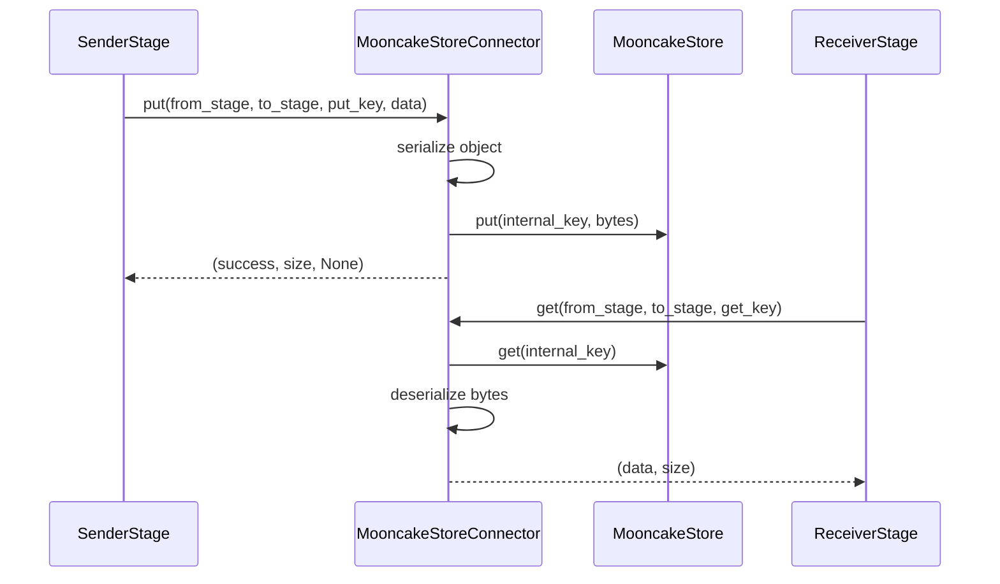

# MooncakeStoreConnector

## When to Use

Best for multi-node distributed inference using Mooncake.

## Installation

```bash
# For CUDA-enabled systems (recommended)
pip install mooncake-transfer-engine

# For non-CUDA systems
pip install mooncake-transfer-engine-non-cuda
```

## Start Mooncake Master

```bash
# If you use Mooncake SSD storage
mkdir -p ./mc_storage

mooncake_master \
  --rpc_port=50051 \
  --enable_http_metadata_server=true \
  --http_metadata_server_host=0.0.0.0 \
  --http_metadata_server_port=8080 \
  --metrics_port=9003 \
  --root_fs_dir=./mc_storage/ \
  --cluster_id=mc-local-1 &
```

## Configuration

Define the connector in runtime:

```yaml
runtime:
  connectors:
    connector_of_mooncake:
      name: MooncakeStoreConnector
      extra:
        host: "127.0.0.1"
        metadata_server: "http://<MASTER_IP>:8080/metadata"
        master: "<MASTER_IP>:50051"
        segment: 512000000
        localbuf: 64000000
        proto: "tcp"
```

Wire stages to the connector:

```yaml
stage_args:
  - stage_id: 0
    output_connectors:
      to_stage_1: connector_of_mooncake

  - stage_id: 1
    input_connectors:
      from_stage_0: connector_of_mooncake
```

Parameters:

- host: local worker IP registered in the metadata server.
- metadata_server: metadata server URL for discovery and setup.
- master: Mooncake Master address.
- segment: global memory segment size in bytes.
- localbuf: local buffer size in bytes.
- proto: transport protocol ("tcp" or "rdma").

For more details, refer to the
[Mooncake repository](https://github.com/kvcache-ai/Mooncake).

---

## Design

### 1. Overview

`MooncakeStoreConnector` is the storage-oriented remote connector in `vllm_omni/distributed/omni_connectors`. It is built on top of Mooncake distributed store APIs and provides a uniform `put()` / `get()` abstraction for transferring stage payloads across nodes.

Compared with `SharedMemoryConnector`, this connector is intended for multi-node deployments. Compared with `MooncakeTransferEngineConnector`, it is simpler and more object-oriented: data is written into a distributed store and fetched back by key, rather than transferred through an explicit remote-memory write protocol.

Its primary role is to provide a general-purpose remote connector for stage payloads when:

- the pipeline spans multiple hosts
- a shared-memory connector is not possible
- a simpler remote backend is preferred over the RDMA-oriented transfer engine

### 2. Relationship with the OmniConnector System

`MooncakeStoreConnector` implements `OmniConnectorBase`, so it integrates with the same connector lifecycle as the other backends:

- `OmniConnectorFactory` instantiates it from `ConnectorSpec`
- `load_omni_transfer_config()` maps edge config to the connector spec
- All callers (batch forwarding, chunk transfer, KV transfer, etc.) interact with it through the same `put()` / `get()` contract

This means the rest of the pipeline does not need store-specific logic. It only relies on the generic connector contract.

### 3. Design Goals

The connector is designed around the following goals:

- **Cross-node object transfer** using a single key-based abstraction
- **Minimal connector-specific control plane**, since the store itself is the shared medium
- **Compatibility with arbitrary Python payloads** through the Omni serializer
- **Operational simplicity** compared with the transfer-engine-based remote connector

The connector is intentionally not optimized for zero-copy tensor movement or direct remote-memory access.

### 4. Core Design

#### 4.1 Object-Oriented Transfer Model

`MooncakeStoreConnector` treats the transport backend as a distributed object store:

1. Serialize the Python object into bytes.
2. Generate a unique connector key.
3. Store the bytes in Mooncake.
4. Fetch the bytes from Mooncake on the receiver side.
5. Deserialize the bytes back into the original object.

This design makes the connector conceptually close to a distributed key-value transport.

#### 4.2 Key Construction

The connector uses `OmniConnectorBase._make_key()` to derive the internal store key:

```text
{request_key}@{from_stage}_{to_stage}
```

This adds stage routing information to the logical request key and avoids collisions between different pipeline edges.

#### 4.3 No Extra Metadata Path

Unlike `SharedMemoryConnector` and `MooncakeTransferEngineConnector`, this connector returns:

```python
metadata = None
```

from `put()`.

This is a meaningful design difference:

- the store itself is the shared rendezvous point
- consumers only need the same key
- no transport handle, address, or side-channel metadata needs to be propagated

As a result, the control plane is simpler for this connector than for the SHM and RDMA variants.

### 5. Initialization

#### 5.1 Required Mooncake Components

The connector requires the Mooncake Python bindings to expose:

- `MooncakeDistributedStore`
- `ReplicateConfig`

If these symbols are unavailable, construction fails immediately with `ImportError`. This keeps startup failures explicit and avoids silent fallback behavior.

#### 5.2 Store Setup

During `_init_store()`, the connector:

1. creates `MooncakeDistributedStore()`
2. calls `store.setup(...)`
3. validates the return code
4. creates a `ReplicateConfig`
5. enables `with_soft_pin = True`

The setup step is completed during connector construction, not lazily at first use.

### 6. Put / Get Flow

#### 6.1 Producer Flow: `put()`

The producer-side flow is:

1. Validate that the store has been initialized.
2. Serialize the payload into bytes.
3. Build the internal key with stage routing information.
4. Call `store.put(key, serialized_data, self.pin)`.
5. Update metrics and return success.

The returned tuple is:

```python
(True, len(serialized_data), None)
```

#### 6.2 Consumer Flow: `get()`

The consumer-side flow is:

1. Validate that the store has been initialized.
2. Build the same internal key.
3. Poll `store.get(key)` for up to 20 retries.
4. Sleep 50 ms between retries.
5. If data is found, deserialize it and return `(data, payload_size)`.
6. If all retries are exhausted, record a timeout and return `None`.

This design gives the connector a bounded waiting model rather than an indefinite blocking get.

### 7. Integration with Stage Communication

All callers use the connector through the same `put()` / `get()` contract:

- the sender calls `put()` to serialize and store the payload
- the receiver calls `get()` to retrieve and deserialize it
- no connector-specific metadata is required, since the store key is the rendezvous point

Because `put()` returns `metadata=None`, the connector is naturally compatible with callers that do not forward metadata (e.g. polling-based flows). The trade-off is that all payloads incur full serialization and deserialization costs, which makes the connector functional but not the highest-performance option for large payloads such as KV cache blocks.

### 8. Data Flow in the Pipeline

The end-to-end transfer model is:



This is a store-mediated remote transfer model rather than a direct peer-to-peer transport model.

### 9. Strengths and Trade-offs

#### Strengths

- Simple conceptual model: store by key, fetch by key.
- No connector-specific metadata handoff is required.
- Works naturally for remote multi-node stage transfer.
- Easy to integrate into the existing connector abstraction.

#### Trade-offs

- Full serialization and deserialization are always required.
- Large payloads are more expensive than in direct-memory transports.
- Runtime behavior depends on external Mooncake services being available.
- Cleanup semantics are weaker than request-scoped local buffer management.

### 10. Important Implementation Characteristics

#### 10.1 Cleanup Is a No-op

`cleanup()` only logs a debug message and does not actively delete remote data. The current design assumes Mooncake-side lifecycle management rather than explicit per-request removal.

This keeps the connector implementation simple but means request-level reclamation is not modeled inside the connector itself.

#### 10.2 Close Releases the Store Handle

Unlike `SharedMemoryConnector`, where `close()` is a no-op, `MooncakeStoreConnector.close()` performs a meaningful shutdown:

1. Calls `self.store.close()` to release the Mooncake store handle.
2. Sets `self.store = None` to prevent further operations.

This ensures the connector releases its connection to the external Mooncake service on shutdown. Errors during close are logged but do not propagate.

#### 10.3 Health Output Uses a Shared Schema

`health()` reports:

- `host`
- `metadata_server`
- `master`
- metrics

and also includes placeholder fields such as `protocol`, `pool_device`, and `pool_size` to keep a more uniform shape across connector health outputs. This reflects a system-level consistency choice rather than a store-specific design need.

#### 10.4 Get Is Retry-Based, Not Event-Driven

The receiver side polls the store with a short retry loop. This is simple and robust, but it means the connector is latency-sensitive to:

- store visibility delay
- network jitter
- payload size

If the payload is not visible within the retry window, the connector reports a timeout.

### 11. Summary

`MooncakeStoreConnector` is the remote, store-based connector in the OmniConnector stack. Its design is straightforward:

- serialize the payload
- store it in Mooncake under a stage-qualified key
- fetch it by the same key on the receiver side
- deserialize it back into the original object

This connector fills an important gap in the system:

1. It enables cross-node transfer without requiring shared memory.
2. It keeps the stage communication model uniform.
3. It provides a simpler operational alternative to the transfer-engine-based remote connector.

Its simplicity is also its main trade-off: it favors a clean object-transfer model over the fast-path and peer-to-peer optimizations implemented by `MooncakeTransferEngineConnector`.
