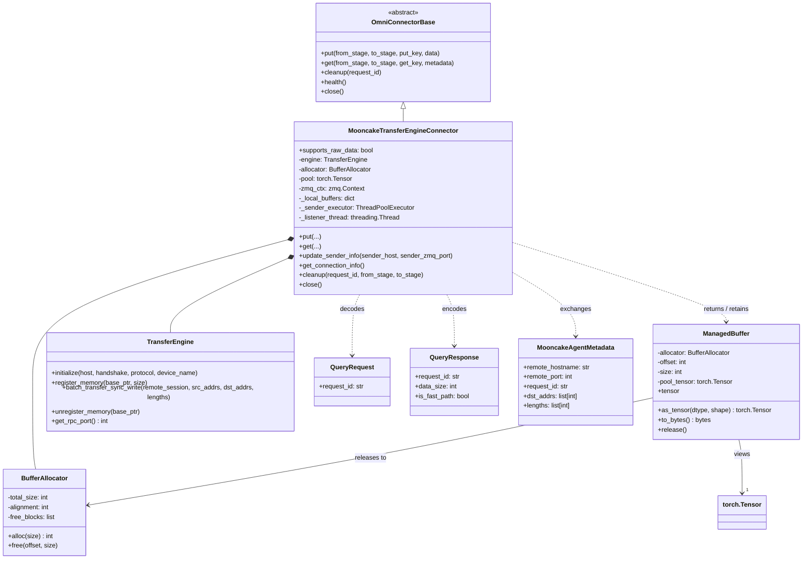
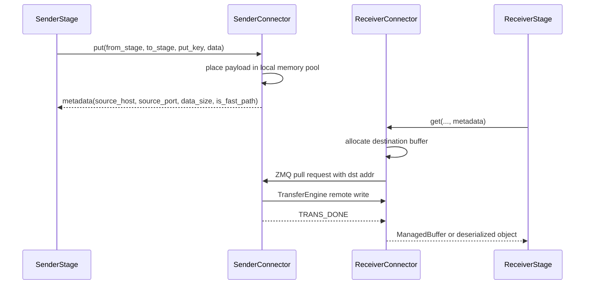

# MooncakeTransferEngineConnector

## When to Use

Best for high-performance multi-node data transfer between stages using Mooncake
Transfer Engine. Supports both RDMA and TCP protocols with a managed memory pool,
zero-copy deserialization, and optional GPUDirect RDMA. Applicable to any
inter-stage data (KV caches, request payloads, etc.), not limited to KV cache transfer.

Compared to `MooncakeStoreConnector` (TCP key-value store), this connector
provides **~60x faster** data transfer via RDMA direct memory access.

## Installation

```bash
pip install mooncake-transfer-engine
```

Ensure RDMA drivers are installed on all nodes (e.g., Mellanox OFED for
InfiniBand/RoCE NICs).

## Configuration

Define the connector in runtime:

```yaml
runtime:
  connectors:
    rdma_connector:
      name: MooncakeTransferEngineConnector
      extra:
        host: "auto"                  # Auto-detect local RDMA IP
        zmq_port: 50051               # ZMQ base port (see "Port Offset Scheme" below)
        protocol: "rdma"              # "rdma" or "tcp"
        device_name: ""               # RDMA device (e.g., "mlx5_0"), empty for auto-detect
        memory_pool_size: 2147483648  # 2GB memory pool
        memory_pool_device: "cpu"     # "cpu" for pinned memory, "cuda" for GPUDirect RDMA
```

Wire stages to the connector:

```yaml
stage_args:
  - stage_id: 0
    output_connectors:
      to_stage_1: rdma_connector

  - stage_id: 1
    input_connectors:
      from_stage_0: rdma_connector
```

## Parameters

### Required

| Parameter | Description |
|---|---|
| `role` | **Internal, do not set manually.** Auto-injected by the orchestration layer (`"sender"` for `output_connectors`, `"receiver"` for `input_connectors`). Defaults to `"sender"` if omitted. |
| `host` | Local IP address for RDMA. `"auto"` detects from network interfaces. |
| `protocol` | Transport protocol: `"rdma"` (InfiniBand/RoCE) or `"tcp"`. |

### Memory Pool

| Parameter | Default | Description |
|---|---|---|
| `memory_pool_size` | 1 GB | Total size of the RDMA-registered memory pool in bytes. |
| `memory_pool_device` | `"cpu"` | `"cpu"`: pinned host memory (recommended). `"cuda"`: GPU VRAM for GPUDirect RDMA (requires NIC-GPU direct PCIe connectivity). |

### Networking

| Parameter | Default | Description |
|---|---|---|
| `zmq_port` | 50051 | ZMQ **base** port. The orchestration layer computes the actual port as `base + purpose_offset + stage_offset` (see table below). Users only set this base value. |
| `sender_host` | `None` | **Internal.** Receiver-side only — dynamically resolved via `update_sender_info()`. Not needed in YAML. |
| `sender_zmq_port` | `None` | **Internal.** Receiver-side only — defaults to the sender's adjusted port. Not needed in YAML. |
| `device_name` | `""` | RDMA device name (e.g., `"mlx5_0"`). Empty for auto-detect. Can also be set via `RDMA_DEVICE_NAME` env var. |

#### ZMQ Port Offset Scheme

To avoid port conflicts when multiple edges, purposes, DP replicas, or TP ranks share the same node, the actual ZMQ port is computed as:

```
side_channel_port = zmq_port + purpose_offset + stage_offset + dp_index * tp_size
sender_listen     = side_channel_port + tp_rank
receiver_connect  = remote_side_channel_port + tp_rank
```

| Component | Value | Description |
|---|---|---|
| `zmq_port` | 50051 (default) | Base port from YAML config |
| `purpose_offset` | `request_forwarding` = 0, `kv_transfer` = 100 | Separates control-plane vs KV-cache connections |
| `stage_offset` | `int(from_stage)` (0, 1, 2...) | Separates edges from different source stages |
| `dp_index * tp_size` | e.g., DP1 × TP2 = 2 | Each DP replica reserves a port range of size `tp_size` (following vLLM convention: `VLLM_MOONCAKE_BOOTSTRAP_PORT + dp_index * tp_size`) |
| `tp_rank` | 0, 1, 2... | Each TP rank within a DP replica uses its own port |
| orchestrator | +200 | Extra offset when caller is the orchestrator (avoids collision with stage workers on the same node) |

**Example** (base=50051, stage 0→1, DP=2, TP=2, kv_transfer):

| Caller | DP | TP rank | Port |
|---|---|---|---|
| Stage worker | DP0 | rank 0 | `50051 + 100 + 0 + 0×2 + 0 = 50151` |
| Stage worker | DP0 | rank 1 | `50051 + 100 + 0 + 0×2 + 1 = 50152` |
| Stage worker | DP1 | rank 0 | `50051 + 100 + 0 + 1×2 + 0 = 50153` |
| Stage worker | DP1 | rank 1 | `50051 + 100 + 0 + 1×2 + 1 = 50154` |
| Orchestrator | — | — | `50051 + 200 + 0 = 50251` |

## Memory Pool Modes

| Mode | Config | Data Flow | Best For |
|---|---|---|---|
| CPU Pinned | `memory_pool_device: "cpu"` | GPU → CPU pool → RDMA → CPU pool → GPU | Most hardware topologies (recommended) |
| GPUDirect | `memory_pool_device: "cuda"` | GPU → GPU pool → RDMA (NIC reads GPU BAR1) → GPU pool | NIC-GPU direct PCIe (PIX topology) |

> **Note**: GPUDirect RDMA requires the NIC and GPU to share a direct PCIe
> switch (PIX topology). On systems where they are connected via PXB or NODE,
> CPU pinned memory is faster due to GPU BAR1 bandwidth limitations.

## Environment Variables

| Variable | Description |
|---|---|
| `RDMA_DEVICE_NAME` | Override RDMA device name (e.g., `mlx5_0`). |
| `MC_IB_PCI_RELAXED_ORDERING` | Set to `1` to enable PCIe relaxed ordering for GPUDirect. |

## Docker / Container Setup

RDMA requires host-level device access:

```bash
docker run -it \
    --cap-add=SYS_PTRACE \
    --cap-add=IPC_LOCK \
    --security-opt seccomp=unconfined \
    --network=host \
    --device=/dev/infiniband \
    -v /sys/class/infiniband:/sys/class/infiniband:ro \
    your-image:tag
```

## Performance

Benchmark results on H800 GPUs with mlx5_0 RDMA NIC (~186 MB KV cache):

| Metric | MooncakeStoreConnector | MooncakeTransferEngineConnector (CPU) |
|---|---|---|
| KV transfer wall time | ~810 ms | **~14 ms** |
| RDMA throughput | N/A (TCP) | ~22 GB/s |
| Speedup | 1x | **58x** |

## Troubleshooting

### Quick Diagnostics

```bash
# 1. Check RDMA devices and link status
ibdev2netdev
# Expected: "mlx5_X port 1 ==> <iface> (Up)"
# RoCE devices map to Ethernet interfaces (e.g., enp75s0f0)
# IB devices map to ib0, ib1, etc.

# 2. Check InfiniBand device details
ibstat

# 3. Verify /dev/infiniband is accessible (required in containers)
ls /dev/infiniband/

# 4. Check Mooncake installation
python -c "from mooncake.engine import TransferEngine; print('OK')"

# 5. Check environment variables
echo "RDMA_DEVICE_NAME=${RDMA_DEVICE_NAME:-<not set>}"
echo "MC_IB_PCI_RELAXED_ORDERING=${MC_IB_PCI_RELAXED_ORDERING:-<not set>}"
```

### Common Issues

| Symptom | Cause | Fix |
|---|---|---|
| `Failed to modify QP to RTR` | Cross-NIC QP handshake failure (multi-NIC DGX) | Set `device_name` to a single RoCE NIC (e.g., `mlx5_2`) or set `RDMA_DEVICE_NAME` env var |
| `transport retry counter exceeded` | RDMA path between incompatible NICs | Same as above — restrict to one NIC |
| `zmq.error.Again: Resource temporarily unavailable` | ZMQ recv timeout (transfer took too long) | Check NIC selection; increase data may need longer timeout |
| `Mooncake Engine initialization failed` | Missing RDMA drivers or `/dev/infiniband` | Install Mellanox OFED; in Docker add `--device=/dev/infiniband` |
| `MemoryError` in allocator | Memory pool too small for payload | Increase `memory_pool_size` |
| GPU transfer slower than CPU | GPU BAR1 bandwidth limitation (PXB/NODE topology) | Use `memory_pool_device: "cpu"` instead of `"cuda"` |

### Multi-NIC Environments (DGX)

On DGX machines with 12+ RDMA NICs, only RoCE NICs (with a bound network
interface) reliably support loopback. IB-only NICs may fail cross-NIC QP
handshakes. To identify RoCE NICs:

```bash
ibdev2netdev | grep -v "ib[0-9]"
# RoCE devices show Ethernet interface names like enp75s0f0
```

Then configure the connector:
```yaml
device_name: "mlx5_2"  # or set RDMA_DEVICE_NAME=mlx5_2
```

See the RDMA Test README in tests/distributed/omni_connectors/README.md
for test-specific setup instructions.

For more details on the underlying engine, refer to the
[Mooncake repository](https://github.com/kvcache-ai/Mooncake).

---

## Design

### 1. Overview

`MooncakeTransferEngineConnector` is the high-performance remote connector in `vllm_omni/distributed/omni_connectors`. It is built on top of Mooncake `TransferEngine` and combines:

- a **direct data plane** for remote memory writes
- a **ZMQ side channel** for metadata lookup, handshake, and completion signaling
- a **managed local memory pool** for both send and receive buffers

Unlike `MooncakeStoreConnector`, which treats the backend as a distributed store, `MooncakeTransferEngineConnector` is designed as a peer-to-peer transport. Its goal is to move large stage payloads efficiently while still fitting the common `put()` / `get()` API defined by `OmniConnectorBase`.

It is the most performance-oriented connector in the current OmniConnector family and is intended for large remote payloads such as:

- KV cache transfer
- stage hidden-state payloads
- streaming chunk payloads
- other binary-heavy inter-stage artifacts

### 2. Relationship with the OmniConnector System

`MooncakeTransferEngineConnector` implements the same connector contract as the other backends:

- `put(from_stage, to_stage, put_key, data)`
- `get(from_stage, to_stage, get_key, metadata=None)`
- `cleanup(request_id, ...)`
- `health()`
- `close()`

It is integrated into the system through the standard connector plumbing:

- `OmniConnectorFactory` constructs the connector from `ConnectorSpec`
- `load_omni_transfer_config()` resolves the edge-level connector configuration
- `get_connectors_config_for_stage()` and `resolve_omni_kv_config_for_stage()` inject the connector role
- All callers (batch forwarding, chunk transfer, KV transfer, etc.) interact with it through the same `put()` / `get()` contract

The key system-level distinction is that this connector is **role-aware**:

- sender instances expose data and listen for pull requests
- receiver instances allocate buffers and actively pull data from the sender

### 3. Design Goals

The connector is designed around four primary goals:

1. **High-throughput remote transfer**
   Avoid store-mediated round trips and write directly into the receiver memory region.

2. **Fast path for raw payloads**
   Support `torch.Tensor`, `bytes`, and `ManagedBuffer` without forcing all traffic through full object serialization.

3. **Unified connector abstraction**
   Preserve the same `put()` / `get()` interface used by the rest of the OmniConnector stack.

4. **Safe lifecycle management**
   Manage allocation, reuse, cleanup, and failure recovery for a registered memory pool.

### 4. Architecture Overview

At a high level, the connector is composed of four main subsystems:



#### 4.1 Transfer Engine

Mooncake `TransferEngine` is responsible for the actual data-plane transfer. It registers local memory and performs synchronous remote writes through:

```python
batch_transfer_sync_write(...)
```

#### 4.2 Managed Memory Pool

Each connector instance owns a large pre-registered memory pool:

- CPU pinned memory when `memory_pool_device == "cpu"`
- GPU memory when `memory_pool_device == "cuda"`

This avoids repeated memory registration and allows each transfer to allocate subranges from one long-lived pool.

#### 4.3 Buffer Manager

Two helper classes control local memory ownership:

- `BufferAllocator`
  Manages aligned subrange allocation and free-list merging.

- `ManagedBuffer`
  Represents one live slice of the pool and exposes:
  - `.tensor`
  - `.as_tensor(dtype, shape)`
  - `.to_bytes()`
  - `.release()`

#### 4.4 ZMQ Side Channel

ZMQ is used for transport coordination, not for the data payload itself. It handles:

- metadata query from receiver to sender
- pull request submission
- completion or error signaling
- internal notification from worker threads back to the listener thread

This split makes the control plane lightweight while keeping the bulk payload on the transfer engine data plane.

### 5. Role Model

#### 5.1 Sender Role

A sender connector:

- accepts `put()` calls
- stores live transfer-ready buffers in `_local_buffers`
- starts a ZMQ listener thread
- responds to metadata queries and pull requests from receivers

#### 5.2 Receiver Role

A receiver connector:

- does not bind the sender-side ZMQ listener
- accepts `get()` calls
- allocates receive buffers from its own pool
- requests metadata or transfer service from the sender

The role is not inferred dynamically. It is injected by the stage configuration layer:

- incoming edge for a stage -> `role="receiver"`
- outgoing edge for a stage -> `role="sender"`

This is important because incorrect role assignment would break initialization semantics.

#### 5.3 Host Auto-Detection

The `host` configuration field supports the special value `"auto"`. When set, the connector auto-detects the local IP address that would be used for external communication (via a UDP socket probe to `8.8.8.8`). If that fails, it falls back to hostname resolution, and ultimately to `127.0.0.1`.

This is useful in environments where the operator does not want to hard-code IP addresses in the connector config.

#### 5.4 RDMA Device Filtering

The `device_name` configuration field allows the operator to specify which RDMA NICs to use (comma-separated, e.g. `"mlx5_0,mlx5_1"`). If not set in config, the connector also checks the `RDMA_DEVICE_NAME` environment variable.

This is important in environments with mixed InfiniBand/RoCE NICs, where not all devices are suitable for the transfer engine.

### 6. Local Memory Management

#### 6.1 Memory Pool Registration

During initialization, the connector:

1. allocates a large pool tensor
2. records its base pointer
3. registers that memory with Mooncake
4. creates a `BufferAllocator` for subrange management

This means every later transfer only allocates offsets inside the pre-registered pool rather than registering memory per request.

#### 6.2 BufferAllocator

`BufferAllocator` maintains a sorted free list of `(offset, size)` blocks and enforces alignment. Its responsibilities include:

- aligned allocation
- freeing previously allocated blocks
- adjacent block merging
- double-free detection
- overlap detection to catch corruption

This is a critical piece of the connector because both sender and receiver depend on long-lived pool reuse.

#### 6.3 ManagedBuffer

`ManagedBuffer` is the main fast-path data wrapper. It can:

- expose the pool slice as a zero-copy 1D `uint8` tensor
- reinterpret that slice as a typed tensor
- copy out the contents as Python `bytes`
- release the slice back to the allocator

The connector uses `ManagedBuffer` in two different ways:

- as a send-side holder to keep the pool slice alive
- as a receive-side return type when `is_fast_path=True`

### 7. Put Flow

#### 7.1 High-Level Behavior

`put()` is only valid in sender mode. Its job is to expose a payload for later remote pull by the receiver.

The high-level flow is:

1. validate connector state and role
2. convert the input into a pool-backed transferable representation
3. store the transfer metadata in `_local_buffers`
4. return lightweight metadata describing how the receiver can fetch the data

#### 7.2 Payload Type Handling

`put()` supports three payload classes:

**A. `ManagedBuffer`**

If the buffer belongs to the same pool, the connector can use it directly without copying. This is the most efficient path.

If the buffer comes from a different pool, the connector falls back to a copy path.

**B. `torch.Tensor` or `bytes`**

These payloads are copied into the local pool and marked as fast-path data:

- no Omni object serialization is required
- receiver can get a `ManagedBuffer` back

**C. Generic Python object**

Any other payload is serialized via `OmniSerializer.serialize(...)` and then copied into the pool.

In this case:

- `is_fast_path=False`
- the receiver will deserialize back into a Python object

#### 7.3 Sender Metadata

The sender returns:

```python
{
    "source_host": self.host,
    "source_port": self.zmq_port,
    "data_size": size,
    "is_fast_path": is_fast_path,
}
```

This metadata is intentionally lightweight. It tells the receiver:

- where the sender-side control plane lives
- how large the remote transfer will be
- whether the payload should be returned as a `ManagedBuffer` or a deserialized object

#### 7.4 Sender Buffer Table

The sender stores each live payload in `_local_buffers` under the stage-qualified key. Each entry contains:

- source addresses
- lengths
- the holder object
- ownership information (`should_release`)
- `is_fast_path`
- creation time

This table is the sender-side truth source for both metadata queries and pull requests.

### 8. Get Flow

#### 8.1 High-Level Behavior

`get()` runs on the receiver side and performs four steps:

1. resolve metadata
2. allocate a destination buffer in the local pool
3. request the sender to write into that destination buffer
4. return either a `ManagedBuffer` or a deserialized object

#### 8.2 Metadata Resolution Paths

The `metadata` parameter in `get()` is optional. The connector supports two resolution modes depending on whether the caller supplies it.

**With metadata**

When the caller passes metadata, the connector uses it directly. The metadata carries:

- `source_host` / `source_port` — sender ZMQ endpoint
- `data_size` — payload byte count
- `is_fast_path` — whether the receiver gets a `ManagedBuffer` or a deserialized object

This mode is suitable when the control plane already forwards the sender's `put()` output to the receiver.

**Without metadata**

When `get(metadata=None)` is called, the connector queries the sender over ZMQ to discover the same fields (`data_size`, `is_fast_path`). The caller must first call:

```python
update_sender_info(sender_host, sender_zmq_port)
```

so that the connector knows where to send the query.

This mode is suitable for polling-based flows (e.g. KV transfer, async chunk transfer) where the receiver does not have metadata from the control plane.

#### 8.3 Destination Allocation

Once metadata is resolved, the receiver:

1. allocates a subrange from its own local pool
2. wraps it in a `ManagedBuffer`
3. builds a `MooncakeAgentMetadata` request containing:
   - receiver hostname
   - receiver RPC port
   - request ID
   - destination addresses
   - transfer lengths

This tells the sender exactly where to write the incoming data.

#### 8.4 Transfer Completion

The receiver then sends the pull request over ZMQ and waits for:

- `TRANS_DONE`
- or `TRANS_ERROR`

If the transfer succeeds:

- for `is_fast_path=True`, the receiver returns `(ManagedBuffer, size)`
- for `is_fast_path=False`, the receiver copies to bytes, deserializes, releases the buffer, and returns `(object, size)`

### 9. Sender-Side Listener Design

#### 9.1 Listener Thread

In sender mode, the connector starts `_zmq_listener_loop()` after initialization. The listener:

- binds `tcp://{host}:{zmq_port}`
- receives incoming requests
- uses a poller for socket events and internal notifications
- periodically reclaims stale buffers

If the bind fails, initialization fails immediately. The code does not silently downgrade the connector role.

#### 9.2 Worker Thread Pool

The listener hands work to `_sender_executor` so that the listener thread does not block on transfer work.

There are two request types:

- metadata query -> `_handle_query_request(...)`
- transfer request -> `_handle_pull_request(...)`

#### 9.3 Query Handling

For metadata queries, the sender looks up the request ID in `_local_buffers` and returns:

- data size
- fast-path flag

This supports consumers that only know the sender endpoint but not the original sender metadata.

#### 9.4 Pull Handling

For a transfer request, the sender:

1. locates the source addresses in `_local_buffers`
2. constructs the remote session identifier
3. calls `batch_transfer_sync_write(...)`
4. replies `TRANS_DONE` or `TRANS_ERROR`

On success, the sender immediately calls `cleanup(meta.request_id)` and frees the producer-side buffer if it owns it.

This choice is important: it makes the connector effectively a **single-consumer transfer model** for each successful put/get pair.

### 10. Fast Path Semantics

This connector explicitly advertises:

```python
supports_raw_data = True
```

That means it can move raw payloads without forcing everything through the Omni object serializer.

#### Fast Path

For `torch.Tensor`, `bytes`, or pool-local `ManagedBuffer`:

- sender returns `is_fast_path=True`
- receiver returns a `ManagedBuffer`
- caller is responsible for calling `release()`

This avoids an unnecessary copy on the receiver side.

#### Serialized Object Path

For arbitrary Python objects:

- sender serializes the payload
- receiver converts the receive buffer to bytes
- receiver deserializes the object
- receive buffer is released internally

This preserves a uniform object-oriented API while still allowing optimized raw-data transport when possible.

### 11. Failure Handling and Cleanup

#### 11.1 Timeouts and Socket Recovery

The receiver caches ZMQ REQ sockets per thread, but invalidates them after failures. This avoids reusing sockets that may be stuck in a bad state after timeout or receive errors.

Timeout is scaled based on payload size:

- a base timeout
- plus additional time for large payloads

This is intended to reduce false timeouts for large remote writes.

#### 11.2 Stale Buffer Reclamation

The sender periodically reclaims old entries from `_local_buffers` using a TTL policy. This protects the memory pool from permanent leaks if a receiver crashes or never consumes a prepared payload.

This is a practical recovery mechanism, although the code notes that TTL cleanup can still race with very long-running in-flight transfers.

#### 11.3 Connector Shutdown

`close()` is a full resource teardown routine. It:

- stops the listener thread
- shuts down the worker executor
- releases all pending buffers
- closes cached sockets
- unregisters memory from the engine when supported
- terminates the ZMQ context
- drops the pool reference

This makes `MooncakeTransferEngineConnector` the most lifecycle-aware connector in the current connector family.

### 12. Current Implementation Constraints

The current code documents several important topology constraints.

#### 12.1 One Sender to One Receiver per Successful Transfer

After a successful transfer, the sender-side buffer is cleaned up immediately. This means the same prepared payload is not retained for multiple independent receivers.

#### 12.2 One Receiver to One Active Sender Endpoint

The receiver only stores one `(sender_host, sender_zmq_port)` pair through `update_sender_info(...)`. So the metadata-query mode is currently single-sender at a time.

#### 12.3 Explicit Buffer Ownership Matters

When the connector allocates a pool slice internally, it is responsible for releasing it. When a caller passes an externally owned `ManagedBuffer`, the connector keeps it alive for transfer but does not assume ownership of its eventual release.

These constraints are consistent with the current implementation and should be treated as design assumptions rather than incidental behavior.

### 13. Data Flow in the Pipeline

The end-to-end sender/receiver interaction is:



For metadata-less polling, the flow simply adds a metadata query step before the pull request.

### 14. Strengths and Trade-offs

#### Strengths

- Best remote-transfer design in the current connector stack for large payloads.
- Supports raw-data fast path.
- Keeps stage communication under the same connector abstraction.
- Includes real lifecycle and memory-pool management.
- Works for both stage payload transfer and KV transfer scenarios.

#### Trade-offs

- More complex than the store-based connector.
- Correctness depends on role injection and endpoint coordination.
- Caller must release fast-path receive buffers.
- Current implementation is optimized for single-consumer transfer semantics.

### 15. Summary

`MooncakeTransferEngineConnector` is the high-performance peer-to-peer transport in the OmniConnector system. Its design combines:

- a registered memory pool
- a safe subrange allocator
- a ZMQ control plane
- a Mooncake transfer-engine data plane

This allows the connector to support both:

1. a **fast path** for raw tensors and bytes
2. a **generic object path** for arbitrary Python payloads

Within vLLM-Omni, it is the connector that most directly targets performance-sensitive remote transfer, especially for large payloads and KV cache movement. Its additional complexity is deliberate: it is the connector that turns the generic OmniConnector abstraction into a transport capable of efficient remote memory movement rather than simple object storage.
