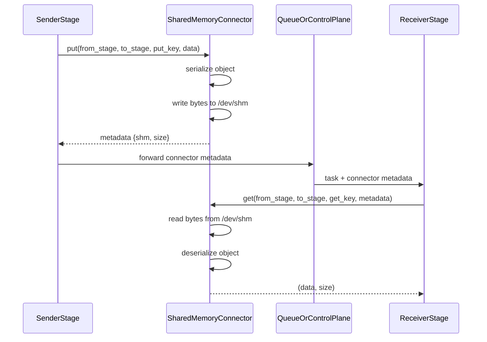

# SharedMemoryConnector

## When to Use

Best for single-node deployments where stages run on the same host. It is
auto-configured when no explicit connector is specified for an edge.

## How It Works

All payloads are serialized and stored in shared memory (`/dev/shm`); the SHM
segment name is returned in metadata. The configuration exposes a
`shm_threshold_bytes` field for a future inline-vs-SHM split, but the current
implementation always uses shared memory regardless of payload size.

## Configuration

```yaml
runtime:
  connectors:
    connector_of_shared_memory:
      name: SharedMemoryConnector
      extra:
        shm_threshold_bytes: 65536
```

## Notes

- Auto-mode uses SharedMemoryConnector if no connector is declared for an edge.

---

## Design

### 1. Overview

`SharedMemoryConnector` is the default same-node connector in `vllm_omni/distributed/omni_connectors`. It is designed for stage-to-stage transfer when producer and consumer processes run on the same host and can share `/dev/shm`.

The connector provides a unified `put()` / `get()` API for arbitrary Python objects while keeping the control plane lightweight:

- The payload is serialized by the connector.
- The serialized bytes are placed in shared memory.
- The queue/control plane only carries a small metadata handle.

This makes `SharedMemoryConnector` the simplest connector in the OmniConnector family and the default fallback when an edge does not explicitly configure another backend.

### 2. Relationship with the OmniConnector System

`SharedMemoryConnector` implements `OmniConnectorBase`, so it follows the same lifecycle and API contract as the other connectors:

- `put(from_stage, to_stage, put_key, data)`
- `get(from_stage, to_stage, get_key, metadata=None)`
- `cleanup(request_id)`
- `health()`
- `close()`

Within the larger system:

- `load_omni_transfer_config()` automatically fills missing edges with `SharedMemoryConnector`.
- Callers interact with the connector exclusively through the `put()` / `get()` / `cleanup()` contract — the connector does not require caller-specific logic.

Compared with the remote Mooncake-based connectors, `SharedMemoryConnector` is intentionally minimal and local-only.

### 3. Design Goals

The connector is built around the following goals:

- **Low-friction local transfer** for single-node multi-process pipelines.
- **Unified object semantics** for arbitrary Python payloads.
- **Small control-plane overhead** by passing only metadata through queues.
- **Zero external dependencies** beyond Python shared memory and the existing stage utilities.

It is not intended to provide cross-node transfer, RDMA, or raw tensor zero-copy semantics across processes.

### 4. Core Design

#### 4.1 Serialization Model

`SharedMemoryConnector` always starts from a Python object and serializes it through the shared Omni serializer:

```python
payload = self.serialize_obj(data)
```

This keeps the connector behavior consistent with the rest of the connector stack:

- producer code does not need connector-specific serialization logic
- consumer code always receives the original object after deserialization
- the connector can reuse the same serializer used by other backends

#### 4.2 Shared Memory as the Data Plane

The actual data plane is a shared-memory segment created by:

- `shm_write_bytes(...)`
- `shm_read_bytes(...)`

The connector stores a small metadata object such as:

```python
{
    "shm": {"name": ..., "size": ...},
    "size": ...
}
```

This metadata is passed over the control plane and allows the downstream stage to locate the shared-memory segment.

#### 4.3 Locking Model

To avoid races between the producer and consumer, the connector uses a lock file per request:

```text
/dev/shm/shm_{put_key}_lockfile.lock
```

Locking is done with `fcntl.flock`:

- producer uses `LOCK_EX`
- consumer uses `LOCK_EX`

Both sides acquire an exclusive lock. This ensures that the shared-memory segment is not read while it is still being written and makes the handoff safer in a multi-process environment.

### 5. Put / Get Flow

#### 5.1 Producer Flow: `put()`

The producer-side flow is:

1. Serialize the input object to bytes.
2. Compute the payload size.
3. Acquire the per-request lock file.
4. Write the bytes into shared memory.
5. Return lightweight metadata to the caller.

The returned tuple is:

```python
(success, serialized_size, metadata)
```

where `metadata` contains the shared-memory handle needed by the consumer.

#### 5.2 Consumer Flow: `get(metadata=...)`

The primary consumer path is metadata-driven:

1. Extract the shared-memory handle from `metadata`.
2. Acquire the exclusive lock.
3. Read the raw bytes from shared memory.
4. Deserialize the bytes back into the original Python object.
5. Remove the lock file if it still exists.

This is the path used by the current stage-to-stage connector flow.

#### 5.3 Compatibility Flow: `get(metadata=None)`

The connector also keeps a compatibility path for callers that only know the key:

1. Attempt to open the shared-memory segment by name via `SharedMemory(name=get_key)`.
2. If the segment exists and has non-zero size, acquire the exclusive lock and read the bytes.
3. Deserialize the bytes and return the object.

If the segment does not exist or any exception occurs, the call returns `None` immediately. There is no retry loop in this path -- it is a single-attempt open.

This path is mainly for older code paths and is not the preferred mode for the current connector pipeline.

### 6. Key Implementation Characteristics

#### 6.1 Threshold Exists, but the Current Code Always Uses SHM

The class keeps a `shm_threshold_bytes` field and still exposes metrics for inline writes. However, the current implementation uses:

```python
if True:
    ...
```

inside `put()`, which means the current code path always writes to shared memory.

So the design still suggests a future split between:

- small payloads inline
- large payloads in shared memory

but the current behavior is effectively:

- all payloads go through shared memory

This should be documented because it affects real runtime behavior.

#### 6.2 Cleanup Is Currently Passive

`cleanup()` is currently a no-op. The intended assumption is:

- the consumer reads the segment
- the underlying shared-memory helpers unlink it

If the consumer never executes `get()`, the shared-memory segment may remain allocated. This means the connector relies on the normal success path for resource reclamation.

#### 6.3 Close Is Currently Minimal

`close()` is also a no-op. There is no connector-owned background thread, socket, or memory pool to tear down, so the lifecycle is simple. The trade-off is that `close()` does not scan or recover leaked shared-memory resources.

### 7. Data Flow in the Pipeline

The typical flow with `SharedMemoryConnector` is:



This is a classic split-control-plane / data-plane design, but constrained to a single host.

### 8. Strengths and Trade-offs

#### Strengths

- Very simple deployment model.
- No external service dependency.
- Fits naturally into the existing queue-driven orchestration flow.
- Good default for local multi-process pipelines.

#### Trade-offs

- Same-node only.
- Full object serialization and deserialization are still required.
- Resource cleanup depends on the normal consumer path.
- Shared memory capacity is limited by host configuration.

### 9. Summary

`SharedMemoryConnector` is the baseline local transport for the OmniConnector system. Its design is intentionally straightforward:

- serialize object
- place bytes in shared memory
- pass metadata through the control plane
- deserialize on the receiving side

It plays two important roles in vLLM-Omni:

1. It is the simplest production-ready connector for same-node stage pipelines.
2. It serves as the automatic fallback connector when no explicit edge transport is configured.

Although the current implementation is deliberately minimal, it provides the foundation for reliable local connector semantics and keeps the stage communication model uniform across the system.
