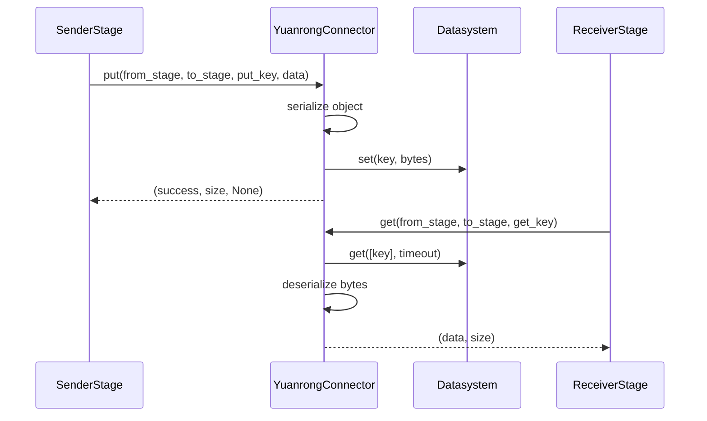

# YuanrongConnector

## When to Use

Best for multi-node distributed inference using Yuanrong Datasystem.

## Mechanism

Uses Yuanrong Datasystem's distributed KV store (`datasystem.kv_client`).

- Data Plane: TCP or RDMA for high-bandwidth transfer.
- Control Plane: Yuanrong Datasystem workers and etcd.
- Keying: deterministic keys based on `put_key` (often composed as `request_id:fromStage_toStage`).

## Installation

```bash
pip install openyuanrong-datasystem
```

## Start etcd

```bash
# Download and install etcd (v3.5.12 or higher)
ETCD_VERSION="v3.5.12"
ETCD_ARCH="linux-arm64"
wget https://github.com/etcd-io/etcd/releases/download/${ETCD_VERSION}/etcd-${ETCD_VERSION}-${ETCD_ARCH}.tar.gz
tar -xvf etcd-${ETCD_VERSION}-${ETCD_ARCH}.tar.gz
cd etcd-${ETCD_VERSION}-${ETCD_ARCH}
sudo cp etcd etcdctl /usr/local/bin/

# Start etcd
etcd \
  --name etcd-single \
  --data-dir /tmp/etcd-data \
  --listen-client-urls http://0.0.0.0:2379 \
  --advertise-client-urls http://0.0.0.0:2379 \
  --listen-peer-urls http://0.0.0.0:2380 \
  --initial-advertise-peer-urls http://0.0.0.0:2380 \
  --initial-cluster etcd-single=http://0.0.0.0:2380 &

# Verify etcd is running
etcdctl --endpoints "127.0.0.1:2379" put key "value"
etcdctl --endpoints "127.0.0.1:2379" get key
```

For production environments, refer to the
[official etcd clustering documentation](https://etcd.io/docs/current/op-guide/clustering/).

## Start Datasystem Worker

```bash
# Replace ${ETCD_IP} with etcd node IP, ${WORKER_IP} with local node IP
dscli start -w \
  --worker_address "${WORKER_IP}:31501" \
  --etcd_address "${ETCD_IP}:2379" \
  --shared_memory_size_mb 20480
```

To stop the worker:

```bash
dscli stop --worker_address "${WORKER_IP}:31501"
```

## Configuration

Define the connector in runtime:

```yaml
runtime:
  connectors:
    connector_of_yuanrong:
      name: YuanrongConnector
      extra:
        host: "127.0.0.1"
        port: 31501
        get_sub_timeout_ms: 1000
```

Wire stages to the connector:

```yaml
stage_args:
  - stage_id: 0
    output_connectors:
      to_stage_1: connector_of_yuanrong

  - stage_id: 1
    input_connectors:
      from_stage_0: connector_of_yuanrong
```

Parameters:

- host: datasystem worker host.
- port: datasystem worker port (default: `35001` if omitted; the example above uses `31501` to match the worker startup command).
- get_sub_timeout_ms: get timeout in milliseconds (0 for no timeout).

For more details, refer to the
[Yuanrong Datasystem repository](https://atomgit.com/openeuler/yuanrong-datasystem).

---

## Design

### 1. Overview

`YuanrongConnector` is the Datasystem-based remote connector in `vllm_omni/distributed/omni_connectors`. It uses Yuanrong Datasystem's distributed key-value client as the transport backend and exposes the same `put()` / `get()` interface as the other OmniConnectors.

Like `MooncakeStoreConnector`, it is a store-oriented remote connector rather than a direct peer-to-peer transport. Its role is to let stage payloads move across nodes through a deterministic key-based storage abstraction while keeping the rest of the pipeline on the common connector API.

It is intended for deployments that already use Yuanrong Datasystem and want a remote connector that integrates with the existing OmniConnector configuration and orchestration model.

### 2. Relationship with the OmniConnector System

`YuanrongConnector` implements `OmniConnectorBase`, so it participates in the same connector lifecycle as the other backends:

- `OmniConnectorFactory` constructs it from a `ConnectorSpec`
- stage edge configuration is resolved by `load_omni_transfer_config()`
- All callers (batch forwarding, chunk transfer, KV transfer, etc.) interact with it through the same `put()` / `get()` contract

This means the connector is not exposed directly to stage logic. Stages only interact with the generic connector contract, and the backend choice remains a configuration concern.

### 3. Design Goals

The connector is built around the following goals:

1. **Cross-node payload transfer through Datasystem**
   Reuse Yuanrong Datasystem as the remote exchange medium for stage data.

2. **Uniform object transfer semantics**
   Allow arbitrary Python objects to be transmitted through the shared Omni serializer.

3. **Minimal connector-specific control plane**
   Use deterministic keys so that consumers can retrieve data without an extra transport metadata handoff.

4. **Operational reuse of existing infrastructure**
   Fit into environments that already deploy Yuanrong Datasystem workers and etcd.

The connector is not designed for direct remote-memory writes or tensor-specific fast-path transfer.

### 4. Core Design

#### 4.1 Store-Oriented Transfer Model

`YuanrongConnector` treats the transport backend as a distributed object store:

1. serialize the Python payload
2. build a deterministic connector key
3. write the serialized bytes into Datasystem
4. read the bytes back on the receiver side
5. deserialize them into the original object

This is the same broad architectural class as `MooncakeStoreConnector`, but implemented on top of Yuanrong Datasystem APIs instead of Mooncake store APIs.

#### 4.2 Deterministic Keying

Unlike the default `_make_key()` in `OmniConnectorBase`, `YuanrongConnector` defines its own key format:

```text
{request_id}:{from_stage}_{to_stage}
```

This has two design implications:

- the request identifier remains the primary lookup handle
- stage routing information is embedded in the key so that the same logical request ID can safely appear on different edges

The explicit override also makes the key format easier to align with Datasystem-side debugging and operational inspection.

#### 4.3 No Extra Metadata Hand-off

`put()` returns:

```python
(success, serialized_size, None)
```

and does not generate connector-specific metadata.

This design works because the receiver can reconstruct the exact same key from:

- `get_key`
- `from_stage`
- `to_stage`

As a result, the connector does not require a separate side-channel metadata handoff.

### 5. Initialization

#### 5.1 Datasystem Client Dependency

The connector requires the Datasystem Python bindings to expose:

- `KVClient`
- `SetParam`
- `WriteMode`

If any of these symbols are unavailable, connector construction fails immediately with `ImportError`. This keeps configuration errors explicit and avoids a partially initialized runtime.

#### 5.2 Client Setup

During `_init_client()`, the connector:

1. reads `host` and `port`
2. creates `KVClient(host, port)`
3. calls `client.init()`

At construction time it also creates a `SetParam` and fixes:

```python
self.set_param.write_mode = WriteMode.NONE_L2_CACHE_EVICT
```

This means the connector has a stable write policy for all writes and does not currently expose write-mode selection as a higher-level connector option.

### 6. Put / Get Flow

#### 6.1 Producer Flow: `put()`

The producer-side flow is:

1. verify that the Datasystem client has been initialized
2. serialize the input object with the shared Omni serializer
3. build the Datasystem key using the connector-specific `_make_key()`
4. call `client.set(key, serialized_data, self.set_param.write_mode)`
5. update metrics and return success

The returned metadata is always `None`, because the Datasystem key itself is the lookup contract between producer and consumer.

#### 6.2 Consumer Flow: `get()`

The consumer-side flow is:

1. verify that the Datasystem client has been initialized
2. rebuild the same key with `from_stage`, `to_stage`, and `get_key`
3. call:

```python
client.get([key], False, self.get_sub_timeout_ms)
```

4. take the first returned element if present
5. deserialize it and return `(data, payload_size)`

If the returned list is empty or contains no data for the key, `get()` returns `None`.

### 7. Timeout and Retrieval Semantics

The connector uses `get_sub_timeout_ms` as its read timeout. Unlike `MooncakeStoreConnector`, which performs an explicit retry loop in Python, `YuanrongConnector` delegates waiting behavior more directly to the Datasystem client call.

This leads to a slightly different retrieval model:

- `MooncakeStoreConnector`: retry-oriented polling in connector code
- `YuanrongConnector`: single client call with backend-managed timeout behavior

From the connector API perspective the result is the same, but operationally the waiting behavior is more dependent on Datasystem client semantics.

### 8. Integration with Stage Communication

All callers use the connector through the same `put()` / `get()` contract:

- the sender calls `put()` to serialize and store the payload
- the receiver calls `get()` to retrieve and deserialize it
- no connector-specific metadata is required, since the Datasystem key is the rendezvous point

Because `put()` returns `metadata=None`, the connector is naturally compatible with callers that do not forward metadata (e.g. polling-based flows). The trade-off is that all payloads incur full serialization and deserialization costs, and there is no raw tensor fast path, which makes the connector functional but not optimized for the largest payloads.

### 9. Data Flow in the Pipeline

The end-to-end transfer model is:



This is a store-mediated remote connector design with deterministic key lookup and no explicit side-channel metadata exchange.

### 10. Strengths and Trade-offs

#### Strengths

- Reuses existing Yuanrong Datasystem infrastructure.
- Keeps the connector contract simple and uniform.
- Requires no connector-specific metadata handoff.
- Suitable for remote stage transfer in Datasystem-based deployments.

#### Trade-offs

- Always pays full serialization and deserialization cost.
- Does not support raw bytes / tensor fast-path semantics.
- Depends on external Datasystem worker availability.
- Retrieval and timeout behavior are partly delegated to the backend client.

### 11. Important Implementation Characteristics

#### 11.1 Cleanup Is a No-op

`cleanup()` only logs a debug message and does not explicitly remove data from Datasystem. The current design assumes backend-side lifecycle or garbage collection rather than request-scoped delete semantics inside the connector.

This mirrors the same design trade-off seen in other store-based connectors: simplicity over explicit per-request data reclamation.

#### 11.2 Close Only Releases the Local Client Handle

`close()` does not perform a remote shutdown. It simply clears the local `client` reference and marks the connector as closed from the process perspective:

```python
self.client = None
```

This is appropriate for a client-based store connector, but it also means that backend resource lifecycle remains outside the connector's control.

#### 11.3 Error and Timeout Metrics Are Coarse-Grained

The connector tracks:

- `puts`
- `gets`
- `bytes_transferred`
- `errors`
- `timeouts`

In the current code, failed `put()` increments `errors`, while `get()` exceptions increment `timeouts`. This is operationally useful, but it does not distinguish between:

- backend timeout
- not-found result
- transport failure
- deserialization failure

So the metrics should be read as high-level health indicators, not detailed root-cause diagnostics.

### 12. Summary

`YuanrongConnector` is the Datasystem-backed remote connector in the OmniConnector family. Its design is straightforward:

- serialize payloads
- store them under a deterministic stage-qualified key
- retrieve them by the same key
- deserialize them on the receiving side

Within vLLM-Omni, it provides a clean integration point for Yuanrong Datasystem-based deployments while preserving the same connector abstraction used by the rest of the pipeline.

Its design priorities are simplicity, infrastructure reuse, and API consistency rather than direct-memory transport optimization.
