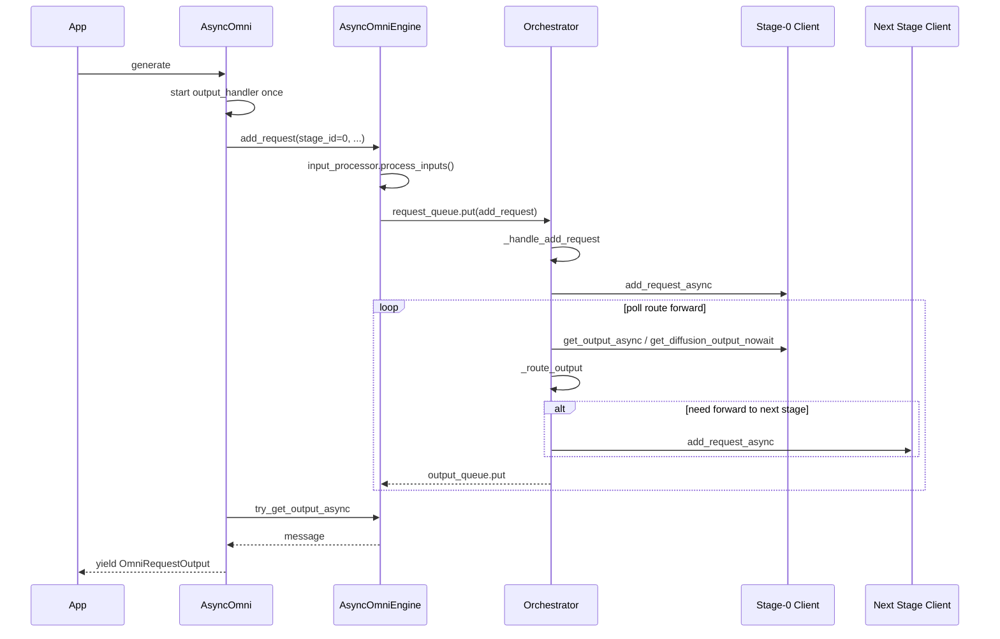

# AsyncOmni Architecture (Qwen3-Omni Example)

## 1. System Architecture

```text
• ┌─────────────────────────────────────────────────────────────────────────────────┐
  │                                    API Layer                                    │
  │  ┌─────────────────────────────────────┐  ┌──────────────────────────────────┐  │
  │  │ AsyncOmni (EngineClient)            │  │ Omni                             │  │
  │  │ • generate() / abort() / shutdown() │  │ • generate()                     │  │
  │  │ • _final_output_handler()           │  │                                  |  │
  │  └─────────────────────────────────────┘  └──────────────────────────────────┘  │
  ├─────────────────────────────────────────────────────────────────────────────────┤
  │                              Engine Layer (Proxy)                               │
  │  ┌───────────────────────────────────────────────────────────────────────────┐  │
  │  │ AsyncOmniEngine                                                           │  │
  │  │ • _bootstrap_orchestrator() & _initialize_stages()                        │  │
  │  │ • add_request() / add_request_async() -> input_processor.process_inputs() │  │
  │  │ • try_get_output() / try_get_output_async()                               │  │
  │  └───────────────────┬─────────────────────────────────▲─────────────────────┘  │
  │         request_queue (janus.Queue)        output_queue (janus.Queue)           │
  ├──────────────────────┼─────────────────────────────────┼────────────────────────┤
  │                      ▼        Orchestration Layer      │                        │
  │  ┌───────────────────────────────────────────────────────────────────────────┐  │
  │  │ Orchestrator [background thread]                                          │  │
  │  │ • _request_handler()                                                      │  │
  │  │     -  stage_client.add_request_async() & _prewarm_async_chunk_stages()   │  │
  │  │ • _orchestration_output_handler()                                         │  │
  │  │     -  _process_stage_outputs() -> output_processors[i].process_outputs() │  │
  │  │     -  _route_output() & _forward_to_next_stage()                         │  │
  │  └──────────┬─────────────────────────┬────────────────────────┬─────────────┘  │
  ├─────────────┼─────────────────────────┼────────────────────────┼────────────────┤
  │             │                 Communication Layer              │                │
  │  ┌───────────────────────┐ ┌───────────────────────┐ ┌───────────────────────┐  │
  │  │ StageEngineCoreClient │ │ StageEngineCoreClient │ │ StageDiffusionClient  │  │
  │  │ • ZMQ ROUTER / PULL   │ │ • ZMQ ROUTER / PULL   │ │ • ZMQ ROUTER / PULL   │  │
  │  │ • Msgpack codec       │ │ • Msgpack codec       │ │ • Msgpack codec       │  │
  │  └──────────┬────────────┘ └──────────┬────────────┘ └──────────┬────────────┘  │
  │             ▼ ZMQ IPC                 ▼ ZMQ IPC                 ▼ ZMQ IPC       │
  ├─────────────────────────────────────────────────────────────────────────────────┤
  │                                 Execution Layer                                 │
  │  ┌───────────────────────┐ ┌───────────────────────┐ ┌───────────────────────┐  │
  │  │ StageCoreProc         │ │ StageCoreProc         │ │ DiffusionEngine       │  │
  │  │ [background process]  │ │ [background process]  │ │ [background process]  │  │
  │  └───────────────────────┘ └───────────────────────┘ └───────────────────────┘  │
  └─────────────────────────────────────────────────────────────────────────────────┘
```

## 2. Execution Flow (Arrow Steps, one generate request)

```text
[1] App
    -> AsyncOmni.generate(prompt, request_id)

[2] AsyncOmni
    -> _final_output_handler()   (started on first request)
    -> AsyncOmniEngine.add_request(stage_id=0, ...)

[3] AsyncOmniEngine.add_request
    -> (if stage-0 is llm and input is not EngineCoreRequest)
       InputProcessor.process_inputs()
       OutputProcessor[0].add_request()
    -> request_queue.put(add_request_msg)

[4] Orchestrator._request_handler
    -> _handle_add_request(msg)
    -> stage_clients[0].add_request_async(...)

[5] Orchestrator._orchestration_loop (loop)
    -> poll stage output
       - llm stage: await get_output_async()
       - diffusion stage: get_diffusion_output_nowait()
    -> (llm stage) output_processors[i].process_outputs(...)
    -> _route_output(...)
    -> if finished and not final_stage and non-async-chunk:
         _forward_to_next_stage(...)
         -> next_stage.add_request_async(...)
    -> output_queue.put(output)

[6] AsyncOmni._final_output_loop (background coroutine)
    -> AsyncOmniEngine.try_get_output_async()
    -> route by request_id to ClientRequestState.queue

[7] AsyncOmni._process_orchestrator_results
    -> read from ClientRequestState.queue
    -> _process_single_result(...)
    -> yield OmniRequestOutput

[8] Exit condition
    -> receive result["finished"] == True
    -> generate() ends
```

## 3. Runtime Sequence (one generate request)



## 4. Comparison

Previous topology (reference):

```text
┌────────────────────────────────────────────────────────────────────────────┐
│ Main Process                                                               │
│  ┌──────────────────────┐   ┌────────────────────────────────────────────┐ │
│  │ generate()           │   │ final_output_handler()                     │ │
│  └──────────────────────┘   └────────────────────────────────────────────┘ │
└──────────┬─────────────────────────┬─────────────────────────┬─────────────┘
  mp.Queue (in_q/out_q)    mp.Queue (in_q/out_q)    mp.Queue (in_q/out_q)
           ▼▲                        ▼▲                        ▼▲
┌───────────────────────┐  ┌───────────────────────┐  ┌──────────────────────┐
│ Worker Proc-0         │  │ Worker Proc-1         │  │ Worker Proc-2        │
│ (Thinker LLM)         │  │ (Talker LLM)          │  │ (Vocoder)            │
│  ┌────────────────┐   │  │  ┌────────────────┐   │  │  ┌────────────────┐  │
│  │_stage_worker   │   │  │  │_stage_worker   │   │  │  │_stage_worker   │  │
│  │_async()        │   │  │  │_async()        │   │  │  │_async()        │  │
│  └────────────────┘   │  │  └────────────────┘   │  │  └────────────────┘  │
│  ┌────────────────┐   │  │  ┌────────────────┐   │  │  ┌────────────────┐  │
│  │output_handler()│   │  │  │output_handler()│   │  │  │output_handler()│  │
│  └────────────────┘   │  │  └────────────────┘   │  │  └────────────────┘  │
└──────────┬────────────┘  └──────────┬────────────┘  └──────────┬───────────┘
       ZMQ ▼ ▲ ZMQ               ZMQ ▼ ▲ ZMQ               ZMQ ▼ ▲ ZMQ
┌──────────────────────┐   ┌──────────────────────┐   ┌──────────────────────┐
│ EngineCore Proc-0    │   │ EngineCore Proc-1    │   │ EngineCore Proc-2    │
│ (Thinker)            │   │ (Talker)             │   │ (Vocoder)            │
└──────────────────────┘   └──────────────────────┘   └──────────────────────┘
```

Current topology:

```text
┌────────────────────────────────────────────────────────────────────────────┐
│ Main Process                                                               │
│  ┌──────────────────────────────────────────────────────────────────────┐  │
│  │ Main Thread                                                          │  │
│  │  ┌──────────────────────┐   ┌─────────────────────────────────────┐  │  │
│  │  │ generate()           │   │ final_output_handler()              │  │  │
│  │  └──────────────────────┘   └─────────────────────────────────────┘  │  │
│  └──────────────────────────────────────────────────────────────────────┘  │
│         janus.Queue (request_queue) ▼  ▲ janus.Queue (output_queue)        │
│  ┌──────────────────────────────────────────────────────────────────────┐  │
│  │ Orchestrator Thread                                                  │  │
│  │  ┌──────────────────────┐  ┌──────────────────────────────────────┐  │  │
│  │  │ _request_handler()   │  │ _orchestration_output_handler()      │  │  │
│  │  └──────────────────────┘  └──────────────────────────────────────┘  │  │
│  │  ┌────────────────────────────────────────────────────────────────┐  │  │
│  │  │ _orchestration_loop(): poll/process/route outputs for all stages│  │  │
│  │  └────────────────────────────────────────────────────────────────┘  │  │
│  └───────┬─────────────────────────┬─────────────────────────┬──────────┘  │
└──────────┬─────────────────────────┬─────────────────────────┬─────────────┘
       ZMQ ▼ ▲ ZMQ               ZMQ ▼ ▲ ZMQ               ZMQ ▼ ▲ ZMQ  
  ┌──────────────────────┐  ┌──────────────────────┐  ┌──────────────────────┐
  │ EngineCore Proc-0    │  │ EngineCore Proc-1    │  │ EngineCore Proc-2    │
  │ (Thinker)            │  │ (Talker)             │  │ (Vocoder)            │
  └──────────────────────┘  └──────────────────────┘  └──────────────────────┘
```


Test scripts:
```bash
# enter offline inference folder.
cd examples/offline_inference/qwen2_5_omni
python end2end.py --output-dir output_audio --query-type use_mixed_modalities

cd ../qwen3_omni
python end2end.py --output-dir output_audio --query-type text --async-chunk --enable-stats

cd ../bagel
python end2end.py --prompts "A cute cat"

cd ../text_to_image
python text_to_image.py --prompt "a cup of coffee on the table" --output output.png
```
