# Speech Generation on vLLM-Omni: Performance Optimizations for Qwen3-Omni and Qwen3-TTS

## Summary

vLLM-Omni supports end-to-end serving for speech-generating models, including both **Qwen3-Omni** (multimodal understanding + speech) and **Qwen3-TTS** (text-to-speech). Despite their different architectures, both models share the same multi-stage pipeline design and benefit from the same set of stacked optimizations:

1. **Batching** improves GPU utilization stage by stage and increases overall throughput.
2. **CUDA Graph** reduces CPU launch overhead and decode-time jitter on stable shapes.
3. **Async Chunk and Streaming Output** overlap compute and communication across stages and emit audio incrementally, improving both TTFP and E2E.

### Model architectures

**Qwen3-Omni** is a native multimodal model that understands text, audio, image, and video inputs, and generates both text and speech outputs. Its pipeline has three stages:

- **Thinker**: multimodal understanding and text generation
- **Talker (+ Talker-MTP / code predictor path)**: converts semantic/text representations into codec tokens
- **Code2Wav**: decodes codec tokens into waveform audio

**Qwen3-TTS** is a lightweight, high-quality text-to-speech model. Its pipeline has two stages:

- **Talker (AR decoder)**: auto-regressively generates codec tokens from text input
- **Code2Wav (vocoder)**: decodes codec tokens into waveform audio

The optimizations described in this post apply to both models. We present results for each side by side.

### vLLM-Omni vs HF Transformers

Compared with **HF Transformers** (offline, single request), vLLM-Omni with the full optimization stack delivers dramatically lower latency and higher efficiency for both models.

**Qwen3-Omni** (A100):

<table><tr>
<td></td>
<td></td>
<td>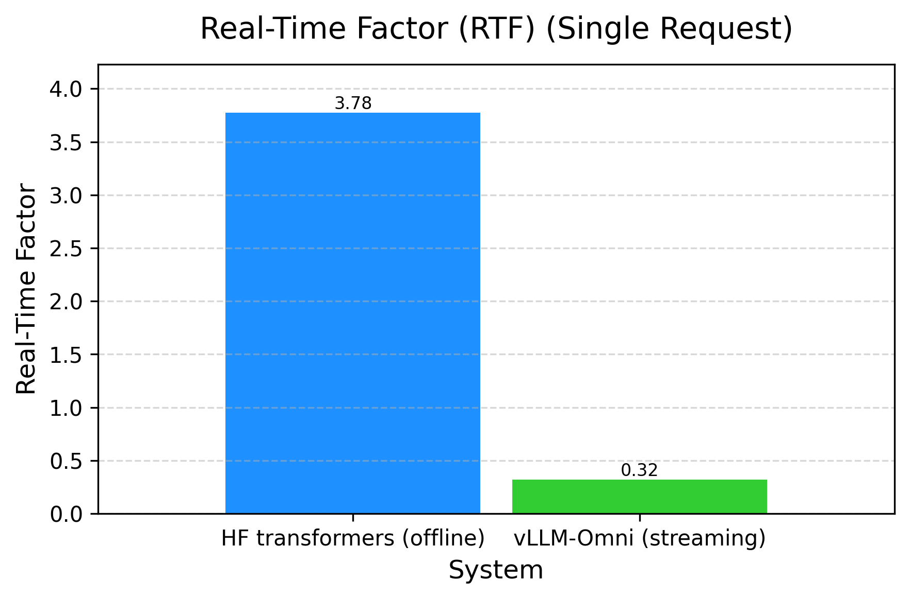</td>
</tr></table>

| Metric | vLLM-Omni | HF Transformers | Improvement |
| --- | --- | --- | --- |
| E2E latency (s) | 23.78 | 336.10 | ~93% reduction |
| TTFP (s) | 0.934 | 336.10 | ~99.7% reduction |
| RTF | 0.32 | 3.776 | ~91% reduction (~12× faster) |

- **E2E latency**: 23.78 s vs 336.10 s - **~93%** reduction
- **TTFP**: 0.934 s vs 336.10 s - **~99.7%** reduction
- **RTF**: 0.32 vs 3.776 - **~91%** reduction (~12x faster)

**Qwen3-TTS** (H200, concurrency 1):

<table><tr>
<td></td>
<td></td>
<td>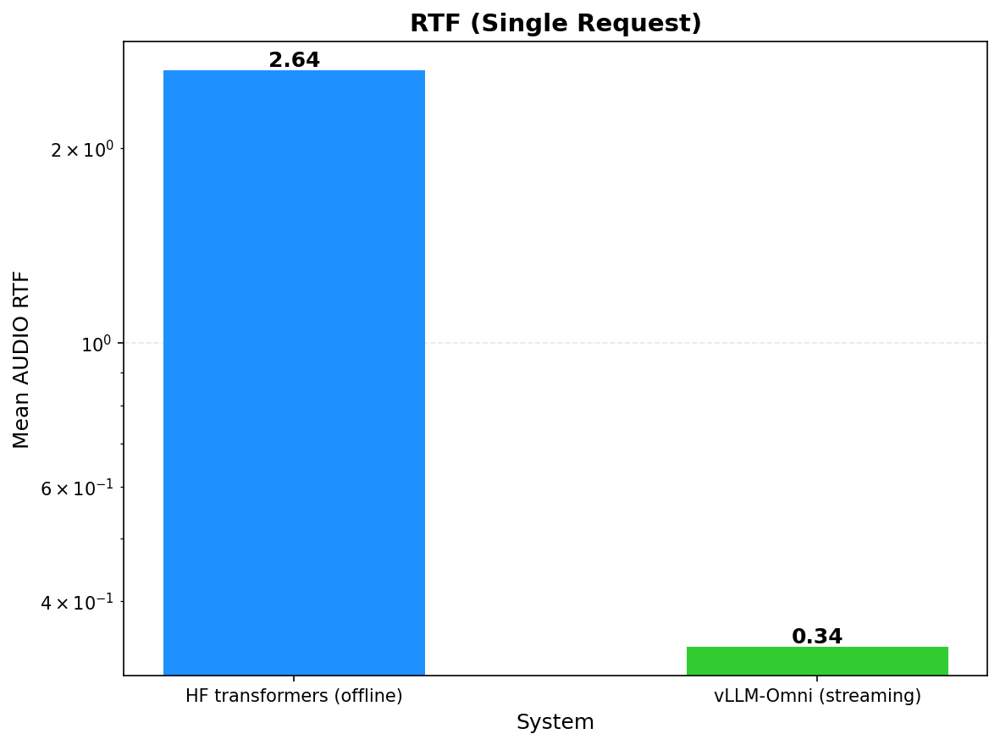</td>
</tr></table>

| Metric | vLLM-Omni | HF Transformers | Improvement |
| --- | --- | --- | --- |
| E2E latency (ms) | 941 | 15,513 | ~94% reduction |
| TTFP (ms) | 64 | 15,513 | ~99.6% reduction (242× faster) |
| RTF | 0.16 | 2.64 | ~94% reduction (~16.5× faster) |

- **E2E latency**: 941 ms vs 15,513 ms - **~94%** reduction
- **TTFP**: 64 ms vs 15,513 ms - **~99.6%** reduction (242x faster)
- **RTF**: 0.16 vs 2.64 - **~94%** reduction (~16.5x faster)

### Stacked optimization summary

Each optimization stacks on the previous one. The summary plots below show the cumulative effect at each step, with one line per concurrency level (1, 4, 10).

**Qwen3-Omni** (A100):

<table><tr>
<td></td>
<td></td>
<td></td>
</tr></table>

- **E2EL reduction**: ~74% at concurrency 10 (410,054 ms -> 104,901 ms); ~90% at concurrency 1 (426,529 ms -> 41,216 ms)
- **TTFP reduction**: ~96% at concurrency 10 (409,705 ms -> 16,482 ms); ~99.7% at concurrency 1 (426,078 ms -> 1,164 ms)
- **RTF reduction**: ~74% at concurrency 10 (2.83 -> 0.74); ~90% at concurrency 1 (2.08 -> 0.21)

**Qwen3-TTS** (H200):

<table><tr>
<td>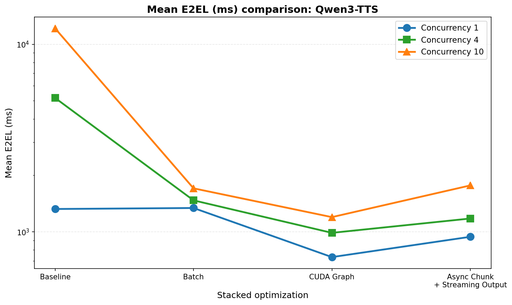</td>
<td>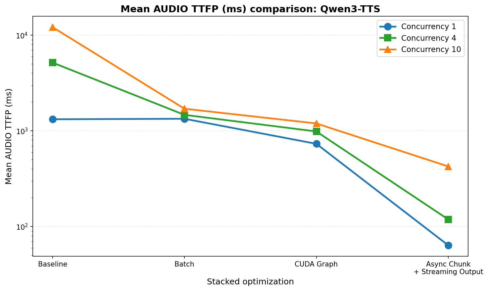</td>
<td></td>
</tr></table>

- **E2EL reduction**: ~85% at concurrency 10 (12,141 ms -> 1,767 ms); ~29% at concurrency 1 (1,323 ms -> 941 ms)
- **TTFP reduction**: ~96.5% at concurrency 10 (12,141 ms -> 425 ms); ~95% at concurrency 1 (1,323 ms -> 64 ms)
- **RTF reduction**: ~86% at concurrency 10 (2.19 -> 0.31); ~30% at concurrency 1 (0.23 -> 0.16)

**Benchmark environment:**

| | Qwen3-Omni                  | Qwen3-TTS |
| --- |-----------------------------| --- |
| **GPU** | A100                        | H200 |
| **Model** | Qwen3-Omni-30B-A3B-Instruct | Qwen3-TTS-12Hz-1.7B-CustomVoice |
| **vLLM** | v0.17.0                     | v0.18.0 |
| **vllm-omni** | commit 199f7832             | v0.18.0rc2 |
| **CUDA** | 12.9                        | 12.8 |

This post walks through each optimization in the same order they are typically enabled in practice, then ends with deployment playbooks for both models.

---

## Pipeline Batching

### How stage-wise batching works

For both Qwen3-Omni and Qwen3-TTS, batching is a pipeline-level optimization:

- Requests are grouped per stage using `runtime.max_batch_size`
- Each stage executes batch inference with its own scheduler/worker
- Stage outputs are routed to downstream stages with per-request mapping preserved

**Batching strategy by stage:** The understanding and decode stages (Thinker for Omni, Talker for both) use **continuous batching**: requests can join and leave the batch over time. Code2Wav uses **static batching**: once a batch is formed, the stage runs the whole batch before starting the next. This matches the decode pattern of Code2Wav and keeps implementation simple while still improving throughput.

### Batching results (Baseline vs. Batch)

Batching alone greatly reduces E2EL and RTF across all concurrencies. The biggest gains appear at high concurrency where requests share GPU resources.

**Qwen3-Omni** (A100):

<table><tr>
<td></td>
<td>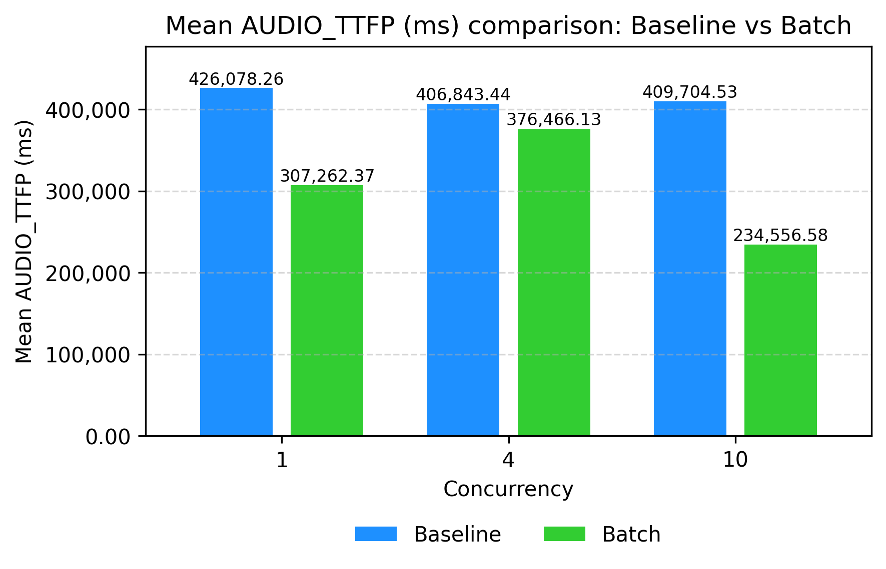</td>
<td>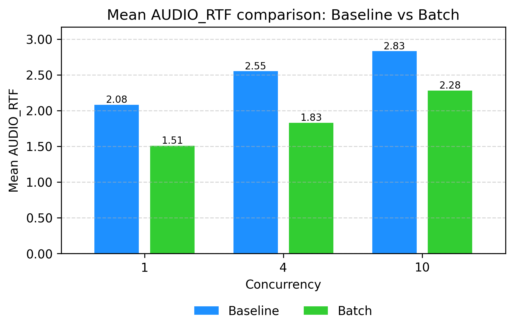</td>
</tr></table>

| Metric | Concurrency | Baseline | + Batch | Improvement |
| --- | --- | --- | --- | --- |
| E2EL (ms) | 1 | 426,529 | 307,719 | 1.4× |
| E2EL (ms) | 4 | 407,213 | 376,934 | 1.1× |
| E2EL (ms) | 10 | 410,054 | 234,844 | 1.7× |
| TTFP (ms) | 1 | 426,078 | 307,262 | 1.4× |
| TTFP (ms) | 4 | 406,843 | 376,466 | 1.1× |
| TTFP (ms) | 10 | 409,705 | 234,557 | 1.7× |
| RTF | 1 | 2.08 | 1.51 | 1.4× |
| RTF | 4 | 2.55 | 1.83 | 1.4× |
| RTF | 10 | 2.83 | 2.28 | 1.2× |

At concurrency 10, E2EL drops from ~410 s to ~235 s; at concurrency 1, from ~427 s to ~308 s.

**Qwen3-TTS** (H200):

<table><tr>
<td>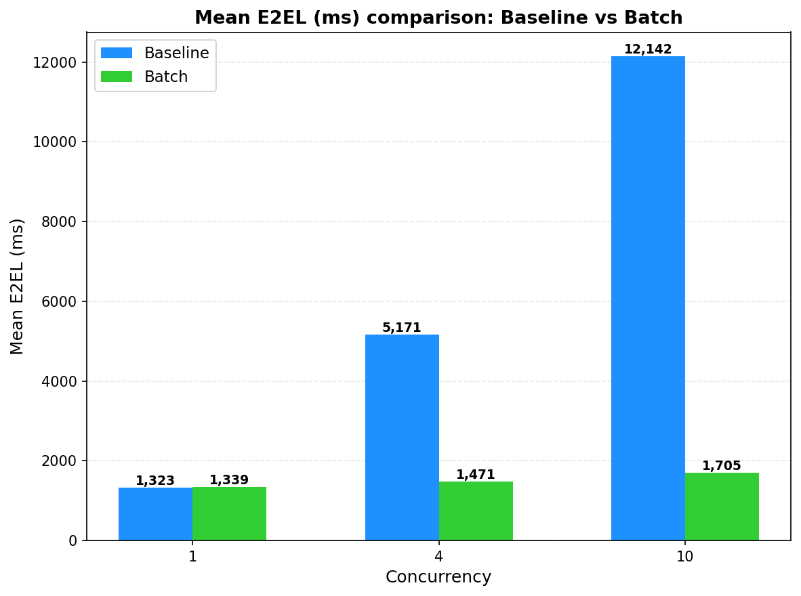</td>
<td>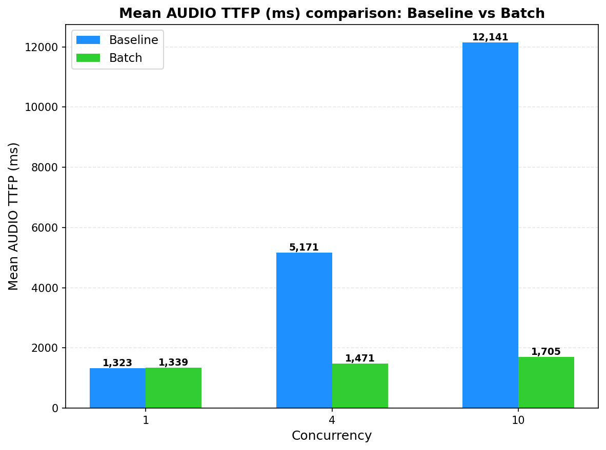</td>
<td>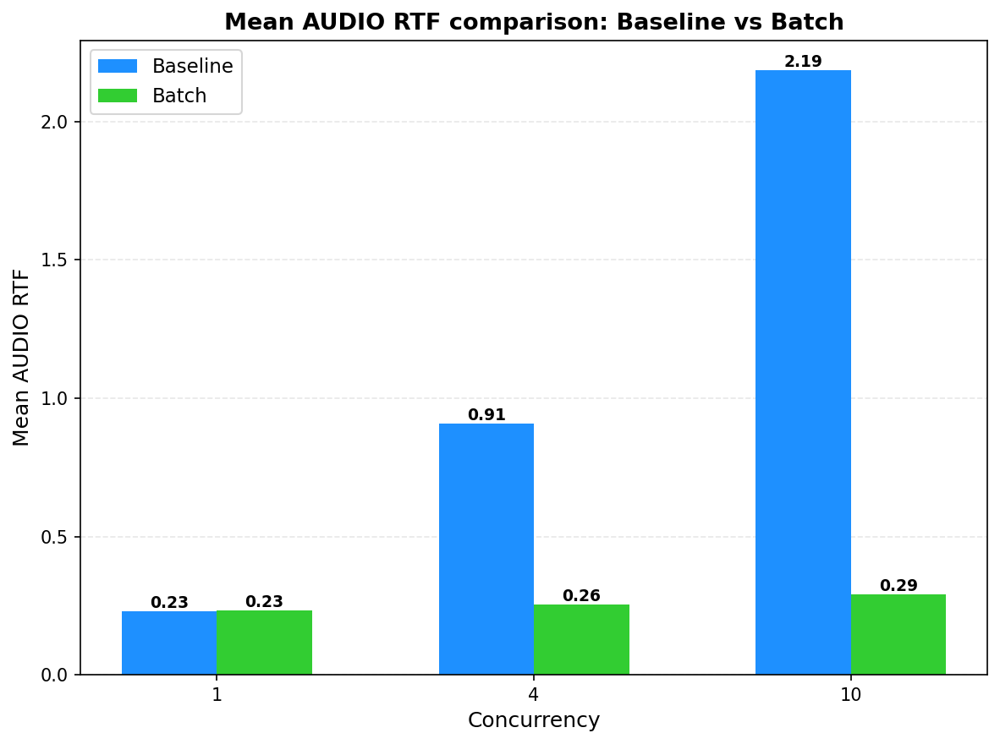</td>
</tr></table>

| Metric | Concurrency | Baseline | + Batch | Improvement |
| --- | --- | --- | --- | --- |
| E2EL (ms) | 1 | 1,323 | 1,339 | 1.0× |
| E2EL (ms) | 4 | 5,171 | 1,471 | 3.5× |
| E2EL (ms) | 10 | 12,141 | 1,705 | 7.1× |
| RTF | 1 | 0.230 | 0.234 | 1.0× |
| RTF | 4 | 0.908 | 0.255 | 3.6× |
| RTF | 10 | 2.186 | 0.292 | 7.5× |
| Throughput (audio-s/wall-s) | 10 | 3.99 | 33.53 | 8.4× |

At concurrency 10, batching alone brings Qwen3-TTS RTF from 2.19 (slower than realtime) down to 0.29 (faster than realtime), and throughput from 4.0 to 33.5 audio-sec/wall-sec.

---

## CUDA Graph on the Critical Decode Path

### Why CUDA Graph helps here

In decode-heavy serving, repeatedly launching many small kernels from CPU can become a visible overhead. CUDA Graph reduces this overhead by capturing and replaying stable execution graphs.

In stage configs, this is represented by `enforce_eager: false` for stages where graph capture is desired (Thinker/Talker), while Code2Wav keeps eager mode depending on stage behavior.

### CUDA Graph results on top of batching

**Qwen3-Omni** (A100):

<table><tr>
<td>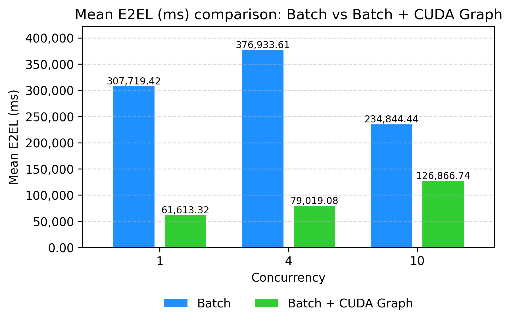</td>
<td>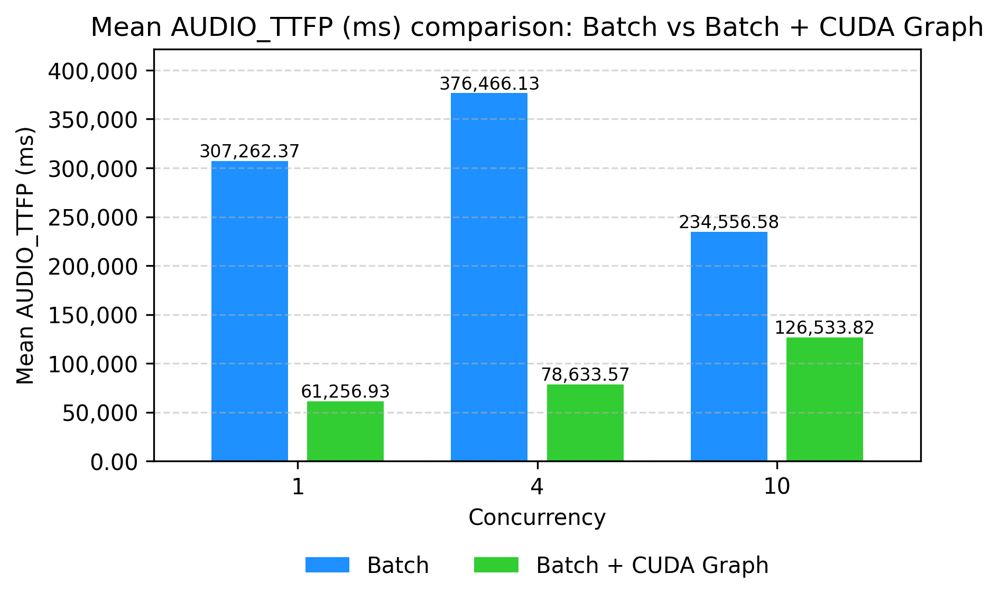</td>
<td>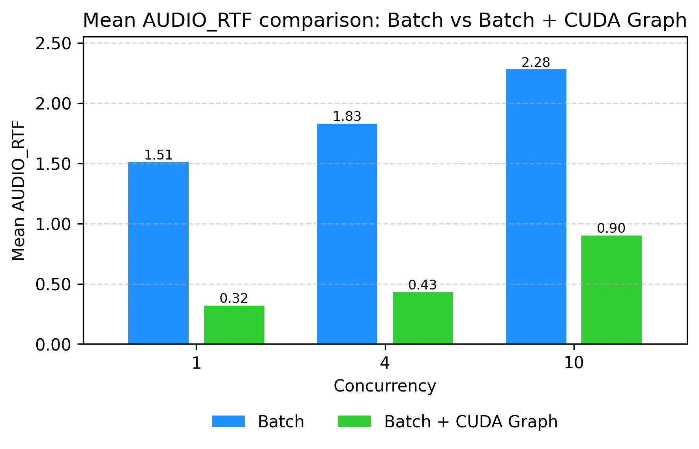</td>
</tr></table>

| Metric | Concurrency | Batch | + CUDA Graph | Improvement |
| --- | --- | --- | --- | --- |
| E2EL (ms) | 1 | 307,719 | 61,613 | 5.0× |
| E2EL (ms) | 4 | 376,934 | 79,019 | 4.8× |
| E2EL (ms) | 10 | 234,844 | 126,867 | 1.9× |
| TTFP (ms) | 1 | 307,262 | 61,257 | 5.0× |
| TTFP (ms) | 4 | 376,466 | 78,634 | 4.8× |
| TTFP (ms) | 10 | 234,557 | 126,534 | 1.9× |
| RTF | 1 | 1.51 | 0.32 | 4.7× |
| RTF | 4 | 1.83 | 0.43 | 4.3× |
| RTF | 10 | 2.28 | 0.90 | 2.5× |

For the larger Qwen3-Omni model (30B-A3B), CUDA Graph provides a significant improvement. At concurrency 1, E2EL drops from ~308 s to ~62 s; at concurrency 10, from ~235 s to ~127 s.

**Qwen3-TTS** (H200):

<table><tr>
<td>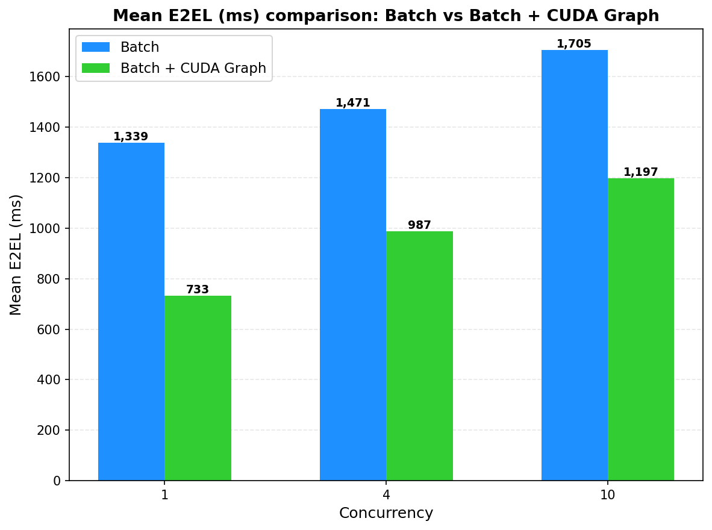</td>
<td>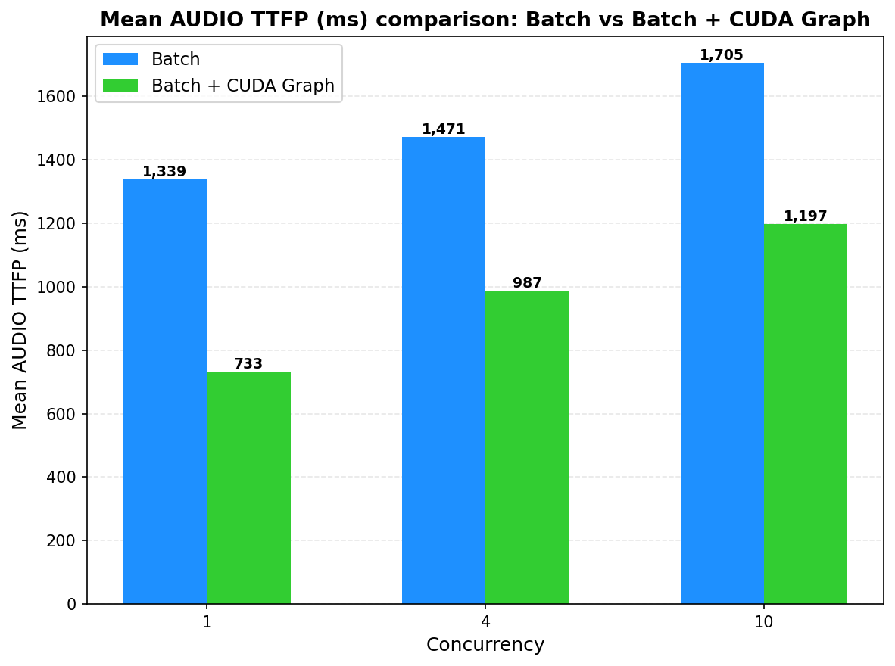</td>
<td>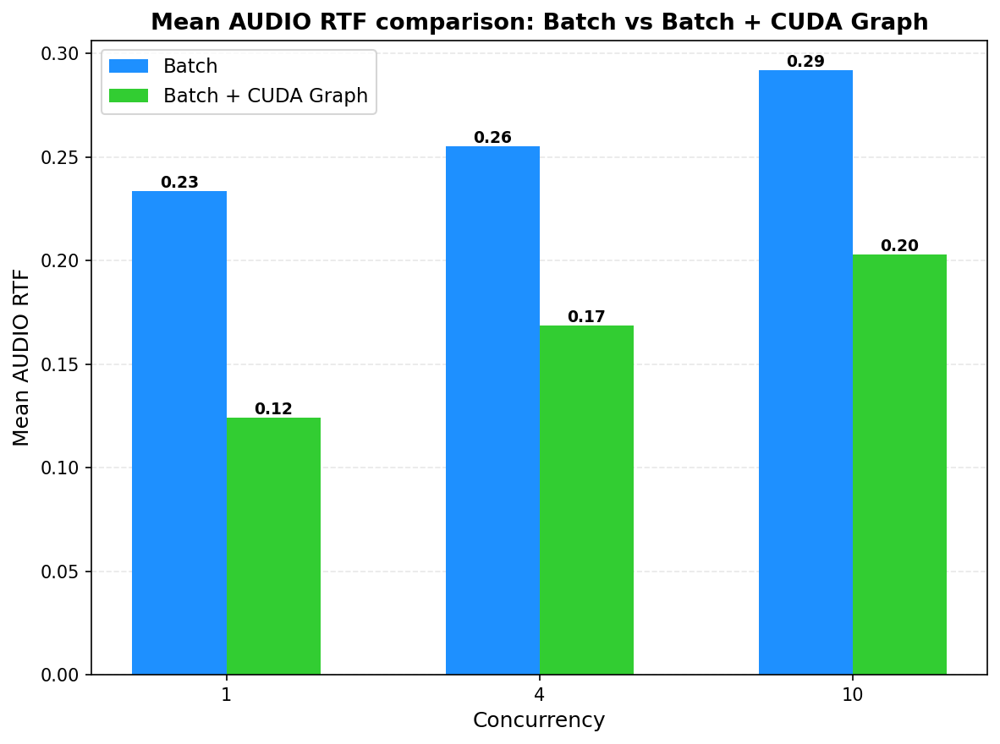</td>
</tr></table>

| Metric | Concurrency | Batch | + CUDA Graph | Improvement |
| --- | --- | --- | --- | --- |
| E2EL (ms) | 1 | 1,339 | 733 | 1.8× |
| E2EL (ms) | 4 | 1,471 | 987 | 1.5× |
| E2EL (ms) | 10 | 1,705 | 1,197 | 1.4× |
| RTF | 1 | 0.234 | 0.124 | 1.9× |
| RTF | 10 | 0.292 | 0.203 | 1.4× |
| Throughput (audio-s/wall-s) | 10 | 33.53 | 47.15 | 1.4× |

At concurrency 1, CUDA Graph reduces E2EL from 1,339 ms to 733 ms and RTF from 0.234 to 0.124 - nearly a 2x improvement. The benefit is consistent across all concurrency levels.

---

## Async Chunk and Streaming Output: Earlier Audio and Cross-Stage Overlap

### Why this step matters for first-packet latency

Two mechanisms work together to improve user-visible latency:

- **Streaming output**: audio streaming emits audio chunks as soon as they are decoded (lower **TTFP**). Without streaming, the client waits for larger buffers or end-of-sequence.
- **Async chunk** is the main enabler for *earlier* audio: instead of handing off whole-request results between stages, each stage forwards **chunks** so the next stage can start as soon as the first chunk is ready. For Omni: Thinker -> Talker forwards hidden-state chunks; for both: Talker -> Code2Wav forwards codec chunks; Code2Wav decodes and emits packets incrementally. This **overlaps compute and communication** across stages and directly reduces time-to-first-audio-packet (TTFP) and end-to-end latency (E2EL).

So in practice: streaming output defines *how* bytes are sent to the client; async chunk defines *when* the pipeline can produce the first bytes.

**Dependency between the two:** Async chunk and audio streaming output are mutually dependent. Without async chunk, **audio streaming output cannot truly take effect**. Without audio streaming output, async chunk's **TTFP advantage is not fully realized**: the client would still wait for larger buffers or end-of-sequence instead of hearing the first packet as soon as it is ready. We therefore recommend enabling **both** on top of batching + CUDA Graph; the benchmarks in this post use both.

### Results: Batch + CUDA Graph vs. Batch + CUDA Graph + Async Chunk + Streaming Output

**Qwen3-Omni** (A100):

<table><tr>
<td>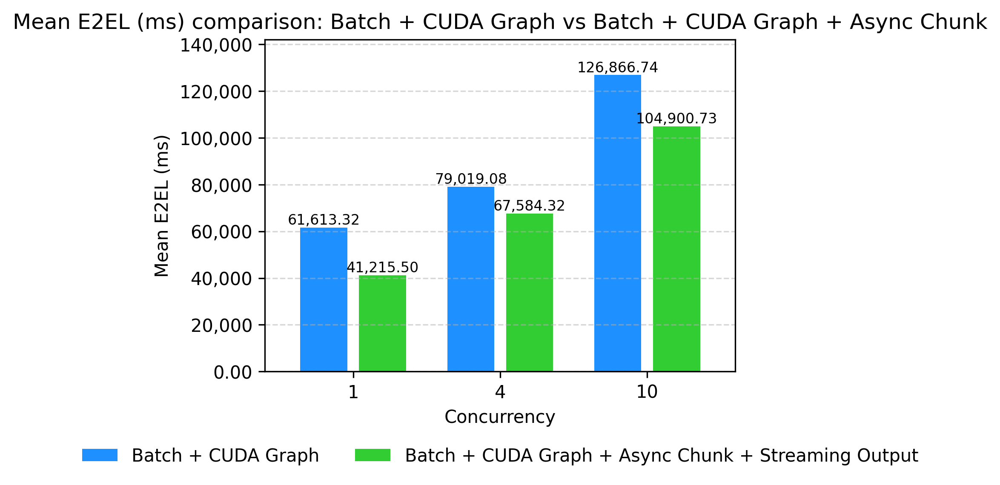</td>
<td>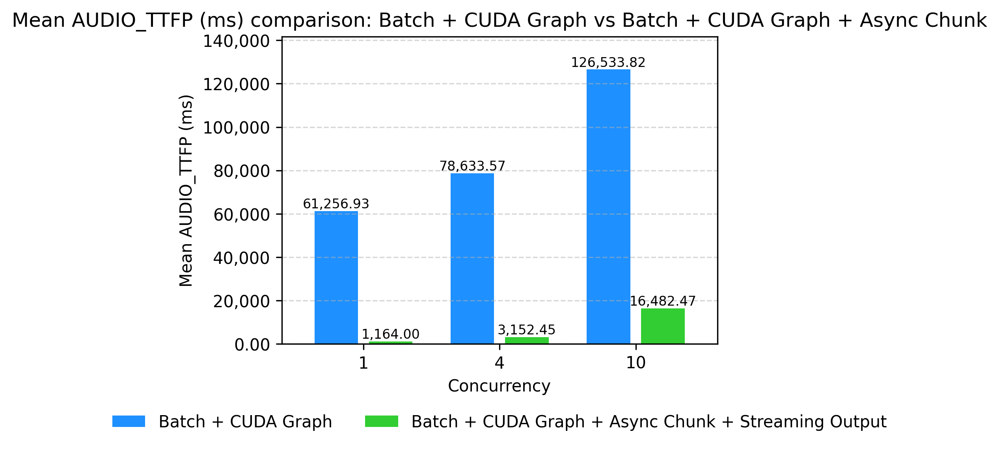</td>
<td>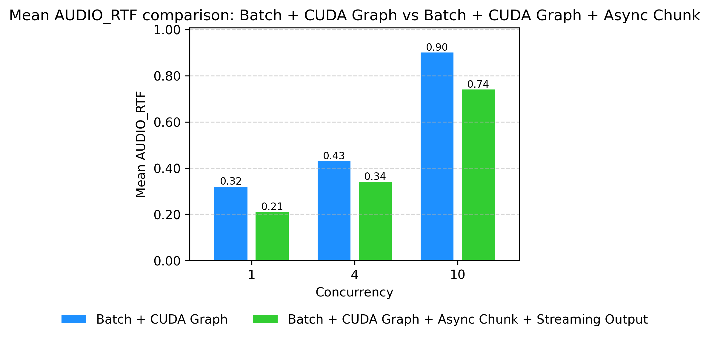</td>
</tr></table>

| Metric | Concurrency | Batch + CG | + Async Chunk | Improvement |
| --- | --- | --- | --- | --- |
| E2EL (ms) | 1 | 61,613 | 41,216 | 1.5× |
| E2EL (ms) | 4 | 79,019 | 67,584 | 1.2× |
| E2EL (ms) | 10 | 126,867 | 104,901 | 1.2× |
| TTFP (ms) | 1 | 61,257 | 1,164 | 53× |
| TTFP (ms) | 4 | 78,634 | 3,152 | 24.9× |
| TTFP (ms) | 10 | 126,534 | 16,482 | 7.7× |
| RTF | 1 | 0.32 | 0.21 | 1.5× |
| RTF | 4 | 0.43 | 0.34 | 1.3× |
| RTF | 10 | 0.90 | 0.74 | 1.2× |

Enabling both brings TTFP down sharply (concurrency 1: 61,257 ms -> 1,164 ms, **~98% reduction**; concurrency 4: 78,634 ms -> 3,152 ms, **~96% reduction**). E2EL and RTF also improve at every concurrency.

**Qwen3-TTS** (H200):

<table><tr>
<td>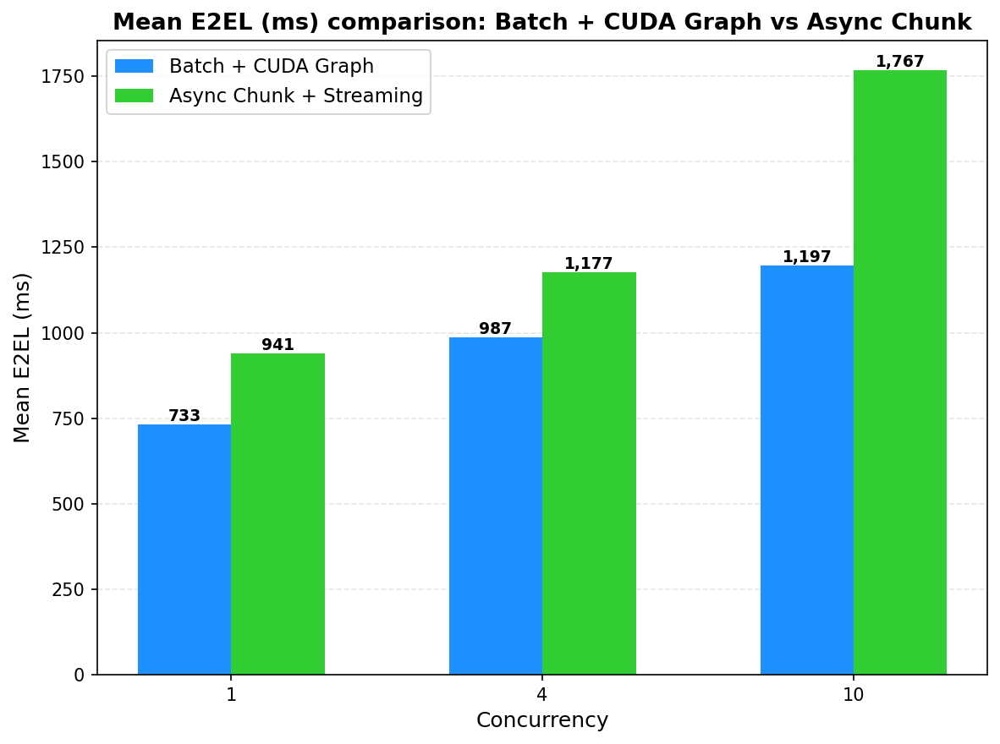</td>
<td>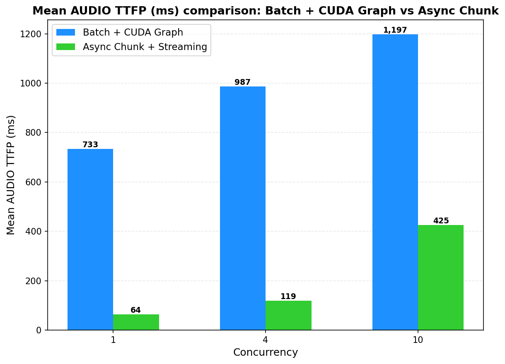</td>
<td>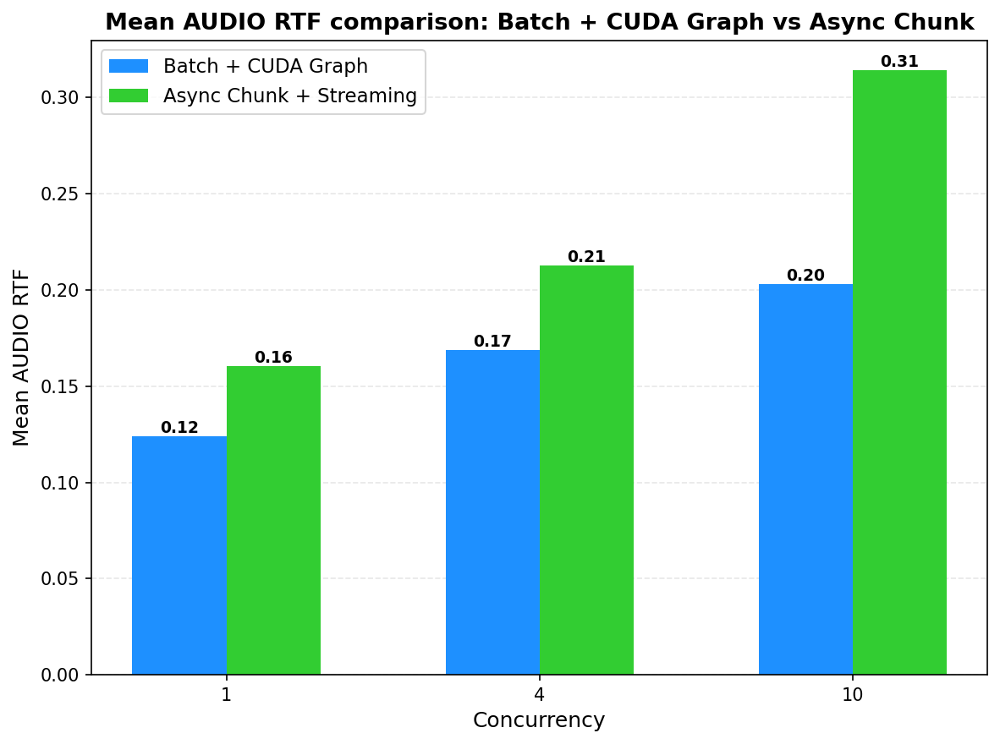</td>
</tr></table>

| Metric | Concurrency | Batch + CG | + Async Chunk | Improvement |
| --- | --- | --- | --- | --- |
| TTFP (ms) | 1 | 733 | **64** | **11.5×** |
| TTFP (ms) | 4 | 987 | **119** | **8.3×** |
| TTFP (ms) | 10 | 1,197 | **425** | **2.8×** |
| E2EL (ms) | 1 | 733 | 941 | 0.8× |
| E2EL (ms) | 10 | 1,197 | 1,767 | 0.7× |
| RTF | 1 | 0.124 | 0.160 | 0.8× |
| RTF | 10 | 0.203 | 0.314 | 0.6× |

The TTFP improvement is the headline result for both models. For Qwen3-TTS at concurrency 1, users hear the first audio in **64 ms** instead of 733 ms - an **11.5x reduction**. For Qwen3-Omni at concurrency 1, TTFP drops from 61 s to 1.2 s - a **53x reduction**.

### Why E2EL and RTF are higher with async chunk (TTS)

The table above shows that enabling async chunk + streaming *increases* E2EL and RTF for TTS compared to CUDA Graph alone. This is expected - the two configurations optimize for fundamentally different metrics:

- **CUDA Graph (no async chunk)** generates the entire audio end-to-end before returning. No chunking overhead, so total compute is minimized.
- **Async Chunk + Streaming** splits the pipeline into incremental chunks, adding overhead from chunked transport, context overlap in Code2Wav (`codec_left_context_frames=25`), and smaller effective batch sizes per chunk.

**The tradeoff is intentional.** Async chunk trades ~30% higher total compute for **11x faster time-to-first-audio**. For interactive applications (voice assistants, chatbots), TTFP determines perceived responsiveness. For offline batch processing, CUDA Graph without async chunk is the better choice.

---

## TTS-Specific: Code Predictor Re-prefill + `torch.compile`

Qwen3-TTS has a **code predictor** - a small 5-layer transformer that generates residual codebook tokens (groups 1 through Q-1) autoregressively. Each AR step operates on very short sequences (2 to ~16 tokens).

The naive approach uses a KV cache for this small transformer, similar to the main Talker. But the KV cache machinery (block tables, slot mappings, paged attention) introduces significant overhead relative to the tiny model. Two optimizations replace that:

### Re-prefill (stateless forward, no KV cache)

Instead of maintaining a KV cache across steps, the code predictor **re-feeds the full growing sequence** at each AR step using `F.scaled_dot_product_attention`. With sequences of at most ~16 tokens through 5 layers, the O(T^2) attention cost is negligible - and removing the KV cache machinery (block table management, `set_forward_context`, slot mapping) saves far more time than it costs.

### `torch.compile` on the code predictor forward

The 5-layer transformer forward pass launches ~60 small CUDA kernels per step. `torch.compile(mode="default", dynamic=True)` fuses these into fewer kernels via Inductor:

```python
self._compiled_model_fwd = torch.compile(
    self.model.forward,
    mode="default",    # no Inductor CUDA graphs, avoids conflict with vLLM's CUDAGraphWrapper
    dynamic=True,      # sequence length grows each step (2, 3, ..., num_groups+1)
)
```

`mode="default"` is used instead of `mode="reduce-overhead"` to avoid conflicts with vLLM's own CUDA graph capture on the main Talker model. `dynamic=True` handles the growing sequence length without recompilation.

These optimizations are always-on in the current codebase - all Qwen3-TTS benchmark results in this post include them.

---

## TTS-Specific: Dynamic Initial Chunk for Faster First Audio

In the async chunk pipeline, the standard `codec_chunk_frames` is 25 (each chunk = ~2 seconds of audio at 12 Hz). Waiting for 25 frames before forwarding the first chunk to Code2Wav adds unnecessary TTFP. The **initial codec chunk** optimization sends a smaller first chunk so Code2Wav can start decoding earlier.

**Dynamic initial chunk sizing (default behavior):**

Rather than using a fixed initial chunk size, vLLM-Omni dynamically selects it based on current server load. The initial chunk size is chosen from power-of-2 steps [2, 4, 8, 16] based on load factor (`active_requests / max_batch_size`):

| Server load | Initial chunk frames | Rationale |
| --- | --- | --- |
| Low (e.g. 1/10 active) | **2** (~167 ms of audio) | Minimize TTFP when there's headroom |
| Medium (e.g. 5/10 active) | **4-8** | Balance TTFP vs decode efficiency |
| High (e.g. 10/10 active) | **16** | Larger first chunk to amortize decode cost |

After the initial chunk, all subsequent chunks use the standard `codec_chunk_frames` (25) size.

**How it works in the pipeline:**

1. Talker generates codec tokens auto-regressively
2. The stage input processor checks current load and picks an initial chunk size (e.g. **2 frames** at low load)
3. After that many frames, the first chunk is forwarded to Code2Wav
4. Code2Wav decodes this small chunk and emits the first audio packet
5. Subsequent chunks use the standard 25-frame size for efficient batch decoding

**Per-request override:** Clients can also set a fixed initial chunk size via the API:

```json
{"initial_codec_chunk_frames": 2}
```

This overrides the dynamic calculation for that request.

**Config (server-side):**

```yaml
runtime:
  connectors:
    connector_of_shared_memory:
      name: SharedMemoryConnector
      extra:
        codec_streaming: true
        codec_chunk_frames: 25              # standard chunk size (~2s of audio)
        codec_left_context_frames: 25
        # initial chunk is computed dynamically by default
        # set initial_codec_chunk_frames: 2 to force a fixed value
```

The 64 ms TTFP result reported above for Qwen3-TTS at concurrency 1 uses the dynamic initial chunk, which picks `initial_codec_chunk_frames=2` at low load. At higher concurrency the dynamic sizing increases the initial chunk to maintain decode efficiency.

---

## Live Demo: Streaming TTS over WebSocket

vLLM-Omni supports real-time streaming audio output for Qwen3-TTS over WebSocket ([PR #1719](https://github.com/vllm-project/vllm-omni/pull/1719)). With `stream_audio: true`, the server sends chunked PCM audio frames as they are generated, so clients can start playback before full sentence synthesis completes.

The WebSocket protocol uses `audio.start` / binary PCM chunks / `audio.done` framing per sentence:

```json
// Client sends:
{"type":"session.config","voice":"Vivian","response_format":"pcm","stream_audio":true}
{"type":"input.text","text":"Hello world. This is a streaming demo."}
{"type":"input.done"}

// Server streams back per sentence:
{"type":"audio.start","sentence_index":0,"sentence_text":"Hello world.","format":"pcm","sample_rate":24000}
<binary PCM chunk 1>
<binary PCM chunk 2>
...
{"type":"audio.done","sentence_index":0,"total_bytes":96000,"error":false}
{"type":"audio.start","sentence_index":1,"sentence_text":"This is a streaming demo.","format":"pcm","sample_rate":24000}
<binary PCM chunk 1>
...
{"type":"audio.done","sentence_index":1,"total_bytes":72000,"error":false}
{"type":"session.done","total_sentences":2}
```

<iframe width="560" height="315" src="https://www.youtube.com/embed/O3IVniwwKNA" frameborder="0" allow="accelerometer; autoplay; clipboard-write; encrypted-media; gyroscope; picture-in-picture" allowfullscreen></iframe>

---

## Deployment Playbook

### Qwen3-Omni

#### 1) Serve with the default 3-stage config

```bash
vllm serve Qwen/Qwen3-Omni-30B-A3B-Instruct \
  --omni \
  --port 8091
```

Notes:

- `runtime.max_batch_size` controls stage-level batching.
- Thinker/Talker commonly use `enforce_eager: false` for CUDA Graph paths.
- Code2Wav often remains eager (`enforce_eager: true`) depending on runtime behavior.

#### 2) Enable async chunk

```bash
vllm serve Qwen/Qwen3-Omni-30B-A3B-Instruct \
  --omni \
  --port 8091 \
  --stage-configs-path vllm_omni/model_executor/stage_configs/qwen3_omni_moe_async_chunk.yaml
```

#### 3) Key config knobs

```yaml
async_chunk: true
stage_args:
  - stage_id: 0  # thinker
    runtime:
      max_batch_size: 64
    engine_args:
      enforce_eager: false
      max_num_batched_tokens: 32768
      custom_process_next_stage_input_func: >-
        vllm_omni.model_executor.stage_input_processors.qwen3_omni.thinker2talker_async_chunk

  - stage_id: 1  # talker
    runtime:
      max_batch_size: 64
    engine_args:
      enforce_eager: false
      max_num_batched_tokens: 32768
      custom_process_next_stage_input_func: >-
        vllm_omni.model_executor.stage_input_processors.qwen3_omni.talker2code2wav_async_chunk

  - stage_id: 2  # code2wav
    runtime:
      max_batch_size: 64
    engine_args:
      enforce_eager: true
      max_num_batched_tokens: 51200
```

#### Reproduce Qwen3-Omni benchmarks

```bash
vllm bench serve \
  --dataset-name random \
  --port ${PORT} \
  --model ${MODEL_PATH} \
  --endpoint /v1/chat/completions \
  --backend openai-chat-omni \
  --max-concurrency ${MAX_CONCURRENCY} \
  --num-prompts ${NUM_PROMPTS} \
  --random-input-len 2500 \
  --ignore-eos \
  --percentile-metrics ttft,tpot,itl,e2el,audio_ttfp,audio_rtf \
  --random-output-len 900 \
  --extra_body '{"modalities": ["text","audio"]}'
```

### Qwen3-TTS

#### 1) Serve with async chunk (recommended)

```bash
vllm-omni serve Qwen/Qwen3-TTS-12Hz-1.7B-CustomVoice \
  --omni \
  --port 8000
```

The default config (`qwen3_tts.yaml`) enables the full optimization stack:

- Batching with `max_batch_size: 10` on the Talker stage
- CUDA Graph on the Talker (`enforce_eager: false`)
- Async chunk with streaming transport

#### 2) Serve without async chunk (for comparison)

```bash
vllm-omni serve Qwen/Qwen3-TTS-12Hz-1.7B-CustomVoice \
  --omni \
  --port 8000 \
  --stage-configs-path vllm_omni/model_executor/stage_configs/qwen3_tts_no_async_chunk.yaml
```

#### 3) Key config knobs

```yaml
async_chunk: true
stage_args:
  - stage_id: 0  # Talker (AR decoder)
    runtime:
      max_batch_size: 10
    engine_args:
      enforce_eager: false
      max_num_batched_tokens: 512
      custom_process_next_stage_input_func: >-
        vllm_omni.model_executor.stage_input_processors.qwen3_tts.talker2code2wav_async_chunk

  - stage_id: 1  # Code2Wav (vocoder)
    runtime:
      max_batch_size: 1
    engine_args:
      enforce_eager: true
      max_num_batched_tokens: 8192

runtime:
  connectors:
    connector_of_shared_memory:
      name: SharedMemoryConnector
      extra:
        codec_streaming: true
        codec_chunk_frames: 25
        codec_left_context_frames: 25
```

#### Reproduce Qwen3-TTS benchmarks

```bash
GPU_DEVICE=0 \
MODEL=Qwen/Qwen3-TTS-12Hz-1.7B-CustomVoice \
NUM_PROMPTS=50 \
CONCURRENCY="1 4 10" \
bash benchmarks/qwen3-tts/vllm_omni/run_stacked_benchmark.sh
```

This cycles through four configs (Baseline -> + Batch -> + CUDA Graph -> + Async Chunk + Streaming), benchmarks each at the specified concurrency levels, and generates all comparison figures automatically.
